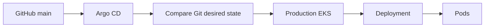
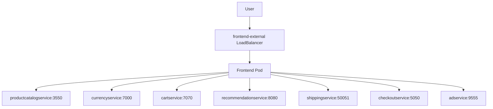
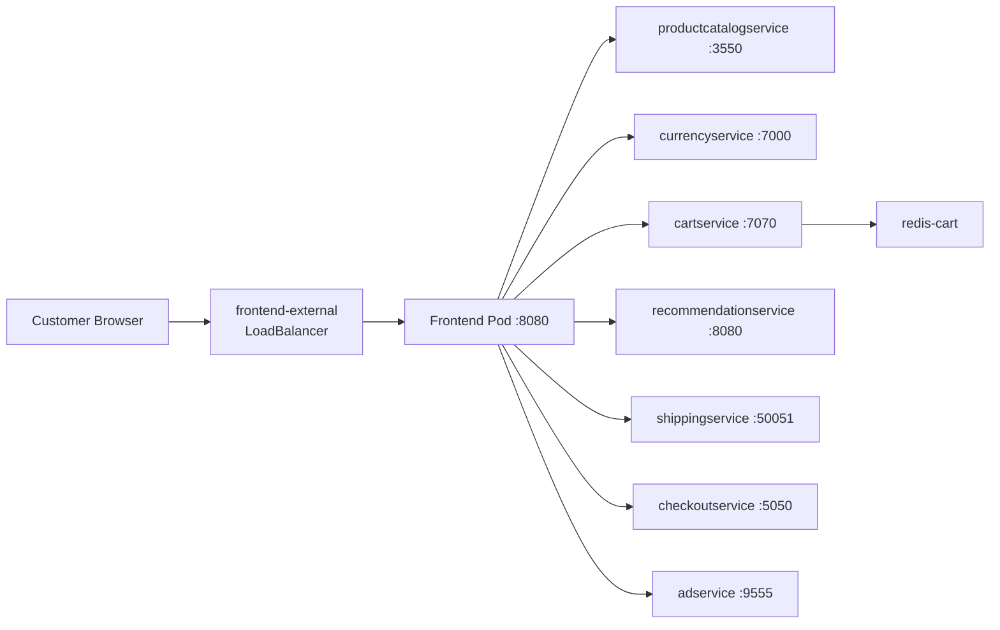
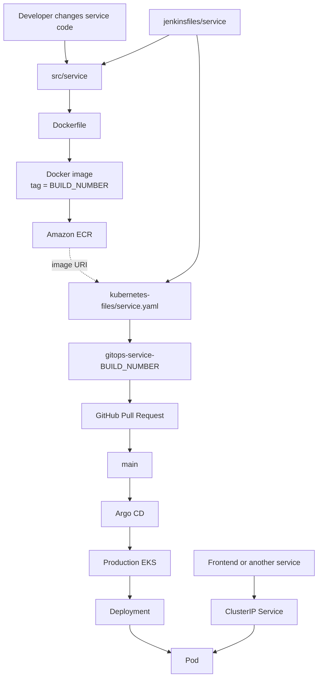

# Production Code Processing Flow — EKS Microservices E-Commerce

Repository reviewed: `openhelpdevops/devops_project5_microservices-e-commerce-eks-project`  
Scope: **Production flow only**  
Audience: Beginner / DevOps learning guide

> The most important idea: **source code is not deployed directly to Kubernetes.**  
> Source code is first converted into a Docker image. The Docker image is pushed to Amazon ECR. The Kubernetes YAML is then changed to point to that image tag. After that YAML change is merged, the GitOps/CD layer can deploy it into EKS.


---

## 1. Repository map

The current repository root contains these major areas:

| Path | Purpose in the flow |
|---|---|
| `src/` | Application source code for the 11 microservices |
| `jenkinsfiles/` | Per-service Jenkins pipeline definitions |
| `kubernetes-files/` | Kubernetes Deployment/Service manifests for the services |
| `ecr-terraform/` | ECR infrastructure area shown in the repository root |
| `eks-terraform/` | EKS infrastructure area shown in the repository root |
| `s3-buckets/` | S3/Terraform-state related infrastructure area shown in the repository root |
| `terraform_main_ec2/` | EC2/base-infrastructure area shown in the repository root |

The application services visible under both `src/` and `jenkinsfiles/` are:

1. `adservice`
2. `cartservice`
3. `checkoutservice`
4. `currencyservice`
5. `emailservice`
6. `frontend`
7. `loadgenerator`
8. `paymentservice`
9. `productcatalogservice`
10. `recommendationservice`
11. `shippingservice`

`kubernetes-files/` contains a matching YAML for those services plus `redis-cart.yaml`.

---

# 2. Think of the repository as three connected layers

## Layer A — Application code

Example:

`src/adservice/`

This directory contains the application source plus its `Dockerfile`. For adservice the repository also contains Gradle files such as:

- `build.gradle`
- `gradlew`
- `settings.gradle`
- Java source under `src/main`
- `Dockerfile`

This is the code that becomes the runnable container image.

## Layer B — CI pipeline

Example:

`jenkinsfiles/adservice`

This is the automation telling Jenkins **how to turn the source code into a deployable artifact**.

The updated adservice pipeline performs:

1. clean workspace
2. clone `main`
3. enter `src/adservice`
4. Docker build
5. authenticate to ECR
6. push the image
7. enter `kubernetes-files`
8. update `adservice.yaml`
9. create GitOps branch
10. commit YAML
11. push GitOps branch
12. create GitHub Pull Request
13. send Pull Request email

## Layer C — Kubernetes desired state

Example:

`kubernetes-files/adservice.yaml`

This file says what Kubernetes should run.

For adservice it contains both:

- `Deployment`
- `Service`

The current adservice Deployment points to an ECR image under the production-style path:

`720973523623.dkr.ecr.us-east-1.amazonaws.com/openhelp/prod/adservice:11`

The Deployment also defines:

- container port `9555`
- CPU/memory requests
- CPU/memory limits
- non-root security context
- readiness probe
- liveness probe

The Service is:

`adservice`

and exposes:

`9555 -> 9555`

That Service name becomes an internal Kubernetes DNS name.

---

# 3. Exact adservice processing order

This is the clearest service in the repository to learn from because its Jenkins pipeline has already been converted to the newer GitOps Pull Request flow.

## Step 1 — Jenkins starts the service pipeline

Pipeline file:

`jenkinsfiles/adservice`

Jenkins must be configured to use this file as its pipeline script.

The pipeline defines:

- `AWS_REGION = us-east-1`
- `AWS_ACCOUNT = 720973523623`
- `IMAGE = adservice`
- `TAG = BUILD_NUMBER`
- `YAML_FILE = adservice.yaml`
- `GITOPS_BRANCH = gitops-adservice-BUILD_NUMBER`

Important relationship:

`Jenkins BUILD_NUMBER -> Docker image tag -> Kubernetes YAML image tag`

Example:

If Jenkins build number is `25`:

`TAG=25`

and the resulting Docker image becomes:

`.../adservice:25`

---

## Step 2 — Jenkins cleans its workspace

Pipeline stage:

`Cleaning Workspace`

Operation:

`cleanWs()`

Purpose:

Jenkins removes files left by an older build so build 25 does not accidentally reuse build 24 files.

---

## Step 3 — Jenkins clones GitHub main

Pipeline stage:

`Clone Repo`

Repository:

`https://github.com/openhelpdevops/devops_project5_microservices-e-commerce-eks-project.git`

Branch:

`main`

After clone, Jenkins has the full repository:

```text
workspace/
├── src/
├── jenkinsfiles/
├── kubernetes-files/
└── ...
```

---

## Step 4 — Jenkins enters only the adservice source directory

Pipeline:

`dir('src/adservice')`

This changes Jenkins' working directory.

So this:

`docker build -t "$IMAGE_PATH" .`

does **not** build the whole repository.

The final `.` means:

> Use the current directory (`src/adservice`) as the Docker build context.

Therefore:

```text
jenkinsfiles/adservice
        |
        | tells Jenkins what to do
        v
src/adservice/Dockerfile
        |
        | Docker reads source + build files
        v
Docker Image
```

---

# 4. What the Dockerfile relationship means

The pipeline does not directly compile Java itself.

Instead it runs:

`docker build ... .`

Docker then processes:

`src/adservice/Dockerfile`

The Dockerfile determines:

- base image
- build stages
- dependencies
- compilation/package steps
- runtime image
- startup command

So the processing relationship is:

```text
Jenkinsfile
   |
   +--> calls docker build
              |
              +--> Dockerfile
                     |
                     +--> application source
                     +--> dependencies
                     +--> build output
                     |
                     +--> final container image
```

This pattern repeats for each microservice, although the internal build technology differs by service.

---

# 5. Jenkins image name calculation

The adservice pipeline calculates:

```text
ECR_REGISTRY =
720973523623.dkr.ecr.us-east-1.amazonaws.com

REPO_URL =
720973523623.dkr.ecr.us-east-1.amazonaws.com/adservice

IMAGE_PATH =
720973523623.dkr.ecr.us-east-1.amazonaws.com/adservice:<BUILD_NUMBER>
```

Example for build `25`:

```text
720973523623.dkr.ecr.us-east-1.amazonaws.com/adservice:25
```

Notice something important:

The Jenkins pipeline's current `REPO_URL` is:

`...amazonaws.com/adservice`

but the checked-in adservice Kubernetes YAML currently contains:

`...amazonaws.com/openhelp/prod/adservice:11`

These are **not the same ECR repository path**.

That is a current repository inconsistency you should fix before treating this as a final production pipeline.

A consistent production convention would use one path everywhere, for example:

`720973523623.dkr.ecr.us-east-1.amazonaws.com/openhelp/prod/adservice:<tag>`

or:

`720973523623.dkr.ecr.us-east-1.amazonaws.com/adservice:<tag>`

but Jenkins, Terraform-created ECR repositories, and Kubernetes YAML must all agree.

---

# 6. Docker image push to ECR

Jenkins authenticates:

```text
aws ecr get-login-password
        |
        v
docker login
        |
        v
Amazon ECR
```

Then:

`docker push "$IMAGE_PATH"`

Example:

```text
Jenkins Build #25
        |
        v
Docker image
adservice:25
        |
        v
Amazon ECR
```

At this stage:

**The application is still NOT deployed to Kubernetes.**

Only the container image exists in ECR.

---

# 7. Kubernetes YAML update

Next Jenkins enters:

`kubernetes-files/`

The pipeline executes a `sed` replacement against:

`adservice.yaml`

Conceptually:

```text
BEFORE

image: old-image:24

AFTER

image: new-image:25
```

The important data handoff is:

```text
BUILD_NUMBER
    |
    v
IMAGE_PATH
    |
    v
kubernetes-files/adservice.yaml
```

This is the bridge between **CI** and **CD**.

---

# 8. Why the YAML is not pushed directly to main

The updated adservice pipeline creates:

`gitops-adservice-<BUILD_NUMBER>`

Example:

`gitops-adservice-25`

It commits only the YAML change and pushes that branch.

Then it creates a Pull Request:

```text
gitops-adservice-25
        |
        | PR
        v
main
```

This is an important production control.

Jenkins can build the software automatically, but production desired state requires review before becoming `main`.

---

# 9. Pull Request approval is the production gate

Before merge:

```text
main
  |
  +--> still contains old production image tag
```

GitOps branch:

```text
gitops-adservice-25
  |
  +--> contains adservice:25
```

After approval + merge:

```text
main
  |
  +--> contains adservice:25
```

That means:

**Git main becomes the source of truth for the desired production deployment.**

---

# 10. Where Argo CD enters

The updated adservice Jenkinsfile does **not** run:

`kubectl apply`

It also does not contain an Argo CD sync command.

Therefore deployment after merge depends on a separate CD/GitOps component.

For your GitOps design, Argo CD should be configured to watch:

```text
Repository:
openhelpdevops/devops_project5_microservices-e-commerce-eks-project

Branch:
main

Path:
kubernetes-files
```

Then:



If auto-sync is enabled:

`merge -> Argo CD detects -> sync -> EKS`

If manual sync is enabled:

`merge -> Argo CD OutOfSync -> operator clicks Sync -> EKS`

The Argo CD Application definition is not visible in the repository areas reviewed, so this part is an external runtime configuration and must be verified in your Argo CD installation.

---

# 11. What EKS does with adservice.yaml

`adservice.yaml` contains two Kubernetes objects separated by `---`.

## Object 1 — Deployment

```text
kind: Deployment
name: adservice
```

The Deployment's job is:

```text
desired Pod template
       |
       v
ReplicaSet
       |
       v
Pod(s)
```

The Pod runs the ECR image.

The container listens on:

`9555`

## Object 2 — Service

```text
kind: Service
name: adservice
type: ClusterIP
```

The Service selector is:

`app: adservice`

The Deployment Pod label is also:

`app: adservice`

This is the relationship:

```text
Service
selector:
app=adservice
      |
      | label match
      v
Pod
label:
app=adservice
```

Without matching labels, the Service would have no backend endpoints.

---

# 12. How the frontend finds adservice

The frontend manifest provides this environment variable:

`AD_SERVICE_ADDR=adservice:9555`

This is a very important Kubernetes relationship.

The frontend does not need an adservice Pod IP.

Pod IPs can change.

Instead it calls:

`adservice:9555`

Kubernetes DNS resolves:

```text
adservice
    |
    v
Service named "adservice"
    |
    v
Ready adservice Pod endpoint
```

---

# 13. Frontend service-to-service data flow

The frontend YAML currently defines these internal addresses:

| Frontend environment variable | Kubernetes Service |
|---|---|
| `PRODUCT_CATALOG_SERVICE_ADDR` | `productcatalogservice:3550` |
| `CURRENCY_SERVICE_ADDR` | `currencyservice:7000` |
| `CART_SERVICE_ADDR` | `cartservice:7070` |
| `RECOMMENDATION_SERVICE_ADDR` | `recommendationservice:8080` |
| `SHIPPING_SERVICE_ADDR` | `shippingservice:50051` |
| `CHECKOUT_SERVICE_ADDR` | `checkoutservice:5050` |
| `AD_SERVICE_ADDR` | `adservice:9555` |

So the application relationship is approximately:



This is how data is passed between services at runtime: mostly through service-to-service network calls using Kubernetes Service DNS names and ports.

---

# 14. Frontend external traffic flow

The frontend YAML contains two Services.

## Internal frontend Service

`frontend`

Type:

`ClusterIP`

Port mapping:

`80 -> 8080`

## External frontend Service

`frontend-external`

Type:

`LoadBalancer`

Port mapping:

`80 -> 8080`

Therefore the visible access path is:

```text
User
 |
 v
AWS Load Balancer created for frontend-external
 |
 v
frontend-external Service
 |
 | selector app=frontend
 v
Frontend Pod :8080
 |
 v
Internal microservices
```

---

# 15. Full production application call flow

A simplified request can look like this:



The exact downstream calls made for a page/request are controlled by the application source code in `src/frontend/`, not by Jenkins.

Kubernetes YAML provides the addresses.

Application code decides **when** and **what data** is sent.

---

# 16. What each file type controls

This distinction removes most beginner confusion.

| File/path | Controls |
|---|---|
| `src/<service>/*` | Business/application logic |
| `src/<service>/Dockerfile` | How source becomes a container image |
| `jenkinsfiles/<service>` | Build/push/GitOps automation |
| `kubernetes-files/<service>.yaml` | How the image runs in Kubernetes |
| Kubernetes Service | Stable DNS + virtual IP to Pods |
| Deployment | Desired Pods/replicas/image/config |
| ECR | Stores built Docker images |
| Git main | Desired deployment version after PR merge |
| Argo CD | Reconciles Git desired state into EKS |
| EKS | Actually runs containers |

---

# 17. End-to-end production flow



---

# 18. Example using Jenkins build #25

Assume an engineer fixes adservice.

## Source change

```text
src/adservice/...
```

## Jenkins

Runs:

`jenkinsfiles/adservice`

Jenkins assigns:

`BUILD_NUMBER=25`

## Build

Jenkins runs Docker from:

`src/adservice/`

Result:

```text
adservice:25
```

## Registry

Image is pushed to ECR.

## GitOps

Jenkins changes:

`kubernetes-files/adservice.yaml`

from old tag to tag `25`.

## Branch

Created:

`gitops-adservice-25`

## Pull Request

```text
gitops-adservice-25 -> main
```

## Approval

Reviewer approves and merges.

## Argo CD

Detects the changed image tag in `main`.

## EKS

Deployment changes from:

```text
old Pod -> image :11
```

to:

```text
new Pod -> image :25
```

## Readiness

Kubernetes waits until the new Pod's gRPC readiness probe on `9555` succeeds.

Only then should the Pod become a healthy Service endpoint.

## Runtime

Frontend calls:

`adservice:9555`

and Kubernetes sends the request to the Ready adservice Pod.

---

# 19. Current repository consistency findings

These findings are important because the repository is currently a mixture of newer and legacy pipeline configuration.

## Finding 1 — adservice is using the newer repository/GitOps PR model

`jenkinsfiles/adservice` currently:

- clones `openhelpdevops/...`
- uses branch `main`
- uses AWS account `720973523623`
- pushes a GitOps branch
- creates a GitHub PR
- sends an email

This is the model described in detail in this guide.

## Finding 2 — several other Jenkinsfiles still contain the old upstream project configuration

For example, the checked files for:

- `cartservice`
- `checkoutservice`
- `currencyservice`
- `emailservice`
- `frontend`

still point to:

`arumullayaswanth/Microservices-E-Commerce-eks-project`

and branch:

`master`

They also use ECR account:

`242201296943`

and push directly to the old repository/branch.

**Therefore these Jenkinsfiles do not currently follow the same production GitOps flow as the updated adservice Jenkinsfile.**

You should not assume every service is production-ready just because adservice is.

## Finding 3 — ECR naming is inconsistent

The updated adservice Jenkinsfile builds:

`720973523623.dkr.ecr.us-east-1.amazonaws.com/adservice:<tag>`

while the current adservice Kubernetes YAML contains:

`720973523623.dkr.ecr.us-east-1.amazonaws.com/openhelp/prod/adservice:11`

Those paths must match the actual ECR repository Terraform creates.

## Finding 4 — frontend YAML still uses the legacy ECR account

The checked frontend YAML currently references:

`242201296943.dkr.ecr.us-east-1.amazonaws.com/frontend:1`

This should be reviewed before calling the repository fully migrated to the new production AWS account.

---

# 20. Recommended final production convention

For a clean production repository, all 11 services should follow exactly one pattern.

Example:

```text
src/adservice/
jenkinsfiles/adservice
kubernetes-files/adservice.yaml

src/cartservice/
jenkinsfiles/cartservice
kubernetes-files/cartservice.yaml

...
```

Pipeline flow:

```text
main
 |
 +--> Jenkins service job
        |
        +--> src/<service>
        |      |
        |      +--> Dockerfile
        |
        +--> ECR openhelp/prod/<service>:BUILD_NUMBER
        |
        +--> kubernetes-files/<service>.yaml
               |
               +--> GitOps branch
                      |
                      +--> PR to main
                             |
                             +--> approval
                                    |
                                    +--> Argo CD
                                           |
                                           +--> prod EKS
```

---

# 21. Recommended processing rule per service

For each service:

```text
SOURCE
src/<service>/

CI PIPELINE
jenkinsfiles/<service>

IMAGE
<prod-ecr>/<service>:<BUILD_NUMBER>

KUBERNETES MANIFEST
kubernetes-files/<service>.yaml

GITOPS BRANCH
gitops-<service>-<BUILD_NUMBER>

PR TARGET
main

CD
Argo CD watches main/kubernetes-files

RUNTIME
Production EKS
```

---

# 22. Files that are NOT automatically "processed together"

A common beginner misunderstanding is:

> "If Jenkins builds adservice, will it process all YAML files?"

In the updated adservice pipeline: **No.**

The variable is:

`YAML_FILE=adservice.yaml`

and Jenkins adds:

`git add "${YAML_FILE}"`

Therefore the adservice build intends to change only:

`kubernetes-files/adservice.yaml`

The other manifests remain unchanged.

Likewise, a cartservice pipeline should update only:

`kubernetes-files/cartservice.yaml`

This is why independent microservices can be deployed independently.

---

# 23. Two very different data flows exist

## CI/CD metadata flow

This is deployment information:

```text
BUILD_NUMBER
   |
   v
Docker image tag
   |
   v
ECR image URI
   |
   v
YAML image:
   |
   v
Git commit / PR
   |
   v
Argo CD
   |
   v
EKS
```

## Runtime business-data flow

This is application traffic:

```text
Browser
   |
   v
frontend
   |
   +--> productcatalogservice
   +--> cartservice
   +--> checkoutservice
   +--> currencyservice
   +--> recommendationservice
   +--> shippingservice
   +--> adservice
```

Do not mix these two concepts.

Jenkins does **not** pass customer cart data.

Kubernetes YAML does **not** compile the application.

The frontend application code handles business requests; the DevOps pipeline delivers versions of that code.

---

# 24. Production troubleshooting by layer

If build fails:

Check:

```text
jenkinsfiles/<service>
src/<service>/Dockerfile
src/<service>/*
Jenkins console
```

If push fails:

Check:

```text
AWS credentials
ECR repository name
ECR account
AWS region
docker login
```

If PR/YAML update fails:

Check:

```text
kubernetes-files/<service>.yaml
GitHub token
git branch
gh CLI
repository name
main branch
```

If Argo CD does not deploy:

Check:

```text
Argo CD Application
repo URL
targetRevision
path
sync status
application events
```

If Pod fails:

Check:

```bash
kubectl get pods
kubectl describe pod <pod>
kubectl logs <pod>
kubectl get events --sort-by=.metadata.creationTimestamp
```

If service-to-service communication fails:

Check:

```bash
kubectl get svc
kubectl get endpoints
kubectl get pods --show-labels
```

Then verify the environment variable address in the caller's YAML.

---

# 25. Beginner memory trick

Remember this sequence:

**CODE -> IMAGE -> REGISTRY -> YAML -> GIT -> ARGO -> EKS -> POD -> SERVICE -> TRAFFIC**

Expanded:

```text
1. CODE
   src/adservice

2. IMAGE
   Dockerfile converts code into image

3. REGISTRY
   Jenkins pushes image to ECR

4. YAML
   Jenkins writes image version into adservice.yaml

5. GIT
   Jenkins creates branch + Pull Request

6. ARGO
   Argo CD sees merged main

7. EKS
   Argo CD applies the manifest

8. POD
   Deployment creates container

9. SERVICE
   adservice ClusterIP points to Ready Pod

10. TRAFFIC
    frontend calls adservice:9555
```

If you remember only one section of this guide, remember this one.

---

# 26. Production validation checklist

Before considering the repository fully production-consistent, verify:

- [ ] All 11 Jenkinsfiles clone `openhelpdevops/...`
- [ ] All 11 use `main`, not the old `master`
- [ ] No pipeline points to the old `arumullayaswanth` repository
- [ ] All pipelines use AWS account `720973523623`
- [ ] ECR repository names exactly match Terraform-created repositories
- [ ] All Kubernetes YAML files use the same production ECR naming convention
- [ ] No YAML still points to account `242201296943`
- [ ] Every pipeline creates a GitOps branch rather than directly changing production `main`
- [ ] Every production change goes through a Pull Request
- [ ] Argo CD watches the correct repository
- [ ] Argo CD target revision is `main`
- [ ] Argo CD path is `kubernetes-files`
- [ ] EKS image pull permissions allow worker nodes to pull from ECR
- [ ] Kubernetes Services have selectors matching Deployment Pod labels
- [ ] Readiness probes are passing before traffic is sent
- [ ] Rollback procedure is documented

---

# 27. Final mental model

There are three sources of truth you should think about:

### Source code truth

`src/<service>/`

Tells you what the application does.

### Build/deployment automation truth

`jenkinsfiles/<service>`

Tells you how a version is built and promoted.

### Runtime desired-state truth

`kubernetes-files/<service>.yaml`

Tells Kubernetes what version/configuration should run.

And then:

```text
Git main
   |
   v
Argo CD
   |
   v
Production EKS actual state
```

That is the complete relationship.

---

## Repository review note

This guide describes the flow actually visible in the current repository, with `adservice` used as the primary production example because it contains the newer GitOps Pull Request workflow. Where legacy service pipelines differ, those differences are called out instead of being silently treated as production-ready.
