# Production Terraform Execution Flow — Complete Beginner Guide

Repository: `openhelpdevops/devops_project5_microservices-e-commerce-eks-project`  
Environment covered: **prod only**  
Terraform architecture: **bootstrap → network → compute → platform**

---

# 1. The Most Important Terraform Concept First

If you are new to Terraform, the first thing to understand is this:

> Terraform does **not** execute `backend.tf`, then `variables.tf`, then `provider.tf`, then `main.tf`, then `outputs.tf` like a normal programming language.

Terraform reads the `.tf` files in the **current directory as one configuration module**.

For example, when you run Terraform from:

`environments/prod/network`

Terraform sees these files together:

```text
backend.tf
main.tf
outputs.tf
provider.tf
variables.tf
versions.tf
terraform.tfvars
```

The `.tf` files form one **root module**.

`terraform.tfvars` provides values to the variables declared by the root module.

Terraform then builds a **dependency graph** from references such as:

```text
aws_subnet.public.vpc_id = aws_vpc.this.id
```

and explicit dependencies such as:

```text
depends_on = [module.iam_compute]
```

The graph — not the filename order — determines which AWS resources are created first.

This is the key mental model for the whole repository.

---

# 2. Is Terraform Object-Oriented?

Terraform is not an object-oriented programming language in the Java/C++ sense.

However, for a beginner, modules can feel somewhat similar to reusable objects:

```text
ROOT MODULE
    |
    | passes inputs
    v
CHILD MODULE
    |
    | creates resources
    |
    | returns outputs
    v
ROOT MODULE
```

A better Terraform vocabulary is:

| Programming idea | Terraform equivalent |
|---|---|
| Reusable component | Module |
| Function arguments | Module input variables |
| Return values | Module outputs |
| Object instance | Module call such as `module "vpc"` |
| Global configuration | Root module |
| Dependency link | Resource/module reference |
| Execution planner | Terraform dependency graph |
| Saved infrastructure memory | Terraform state |

For this repository, think:

```text
environments/prod/network
        |
        | calls
        v
modules/vpc
```

The environment directory says **what values prod should use**.

The reusable module says **how those AWS resources are built**.

---

# 3. Complete Production Directory Structure

The production Terraform path is logically:

```text
repository/
│
├── bootstrap/
│   ├── main.tf
│   ├── outputs.tf
│   ├── provider.tf
│   ├── terraform.tfvars
│   ├── variables.tf
│   └── versions.tf
│
├── environments/
│   └── prod/
│       │
│       ├── network/
│       │   ├── backend.tf
│       │   ├── main.tf
│       │   ├── outputs.tf
│       │   ├── provider.tf
│       │   ├── terraform.tfvars
│       │   ├── variables.tf
│       │   └── versions.tf
│       │
│       ├── compute/
│       │   ├── backend.tf
│       │   ├── main.tf
│       │   ├── outputs.tf
│       │   ├── provider.tf
│       │   ├── terraform.tfvars
│       │   ├── variables.tf
│       │   └── versions.tf
│       │
│       └── platform/
│           ├── backend.tf
│           ├── main.tf
│           ├── outputs.tf
│           ├── provider.tf
│           ├── terraform.tfvars
│           ├── variables.tf
│           └── versions.tf
│
├── modules/
│   ├── vpc/
│   ├── security-group/
│   ├── iam-compute/
│   ├── ec2/
│   ├── iam-eks/
│   ├── eks/
│   ├── ecr/
│   └── s3/
│
└── scripts/
    ├── apply-environment.ps1
    └── destroy-environment.ps1
```

---

# 4. Complete Production Execution — One Picture

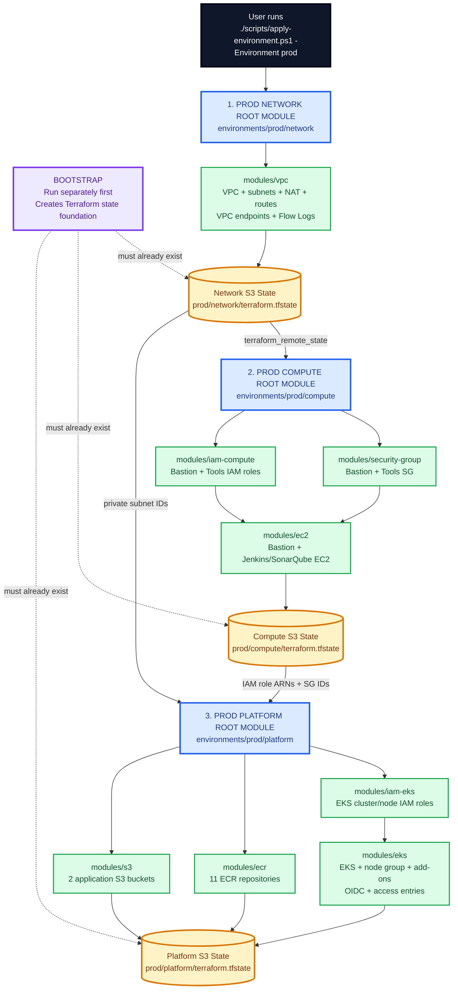

The production layer order is therefore:

```text
BOOTSTRAP   <- normally done once
    ↓
NETWORK
    ↓
COMPUTE
    ↓
PLATFORM
```

The repository's PowerShell apply script runs:

```text
network → compute → platform
```

Bootstrap is intentionally outside that loop because it creates the storage that those three Terraform layers need for their remote state.

---

# 5. What Happens When You Choose `prod`

The command is:

```powershell
./scripts/apply-environment.ps1 -Environment prod
```

The script has:

```powershell
foreach ($Layer in @("network", "compute", "platform"))
```

Therefore PowerShell constructs these paths:

```text
environments/prod/network
environments/prod/compute
environments/prod/platform
```

It enters each directory one at a time.

For every layer it executes:

```text
terraform init -reconfigure
terraform fmt -check
terraform validate
terraform plan -out=tfplan
terraform apply tfplan
```

Only after one layer successfully applies does it move to the next layer.

---

# 6. The Real "Call Stack"

For `prod`, think of the call stack like this:

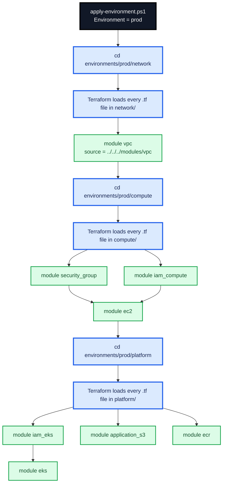

---

# 7. Very Important: Files Are Not "Called" One-by-One

A common beginner assumption is:

```text
backend.tf
   ↓
variables.tf
   ↓
terraform.tfvars
   ↓
provider.tf
   ↓
main.tf
   ↓
outputs.tf
```

That is **not** Terraform's execution model.

The more accurate model is:

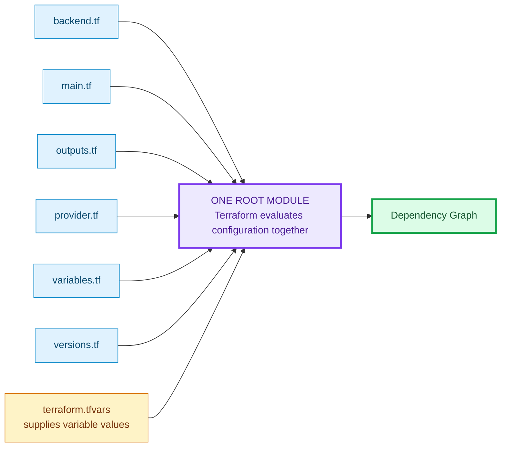

File names are mainly for human organization.

Terraform determines resource order from references and dependencies.

---

# 8. What Each Root File Does

Every production layer uses a similar structure.

## `versions.tf`

Purpose:

- Defines supported Terraform version.
- Defines required provider plugins.
- Defines provider version constraints.

Production network uses:

```text
Terraform >= 1.10.0 and < 2.0.0
AWS provider ~> 6.0
```

Production platform also requires:

```text
TLS provider ~> 4.0
```

Why TLS is needed:

The EKS module uses:

`data "tls_certificate" "eks_oidc"`

to obtain the OIDC issuer certificate fingerprint for the EKS OIDC provider.

---

## `backend.tf`

Purpose:

Tells Terraform **where to store the state for this root module**.

Each prod layer has a separate state object.

### Network state

```text
Bucket:
openhelp-terraform-network-state-5739c46b679a

Key:
prod/network/terraform.tfstate
```

### Compute state

```text
Bucket:
openhelp-terraform-compute-state-5739c46b679a

Key:
prod/compute/terraform.tfstate
```

### Platform state

```text
Bucket:
openhelp-terraform-platform-state-5739c46b679a

Key:
prod/platform/terraform.tfstate
```

All three use:

```text
use_lockfile = true
encrypt      = true
KMS encryption
```

This is why bootstrap must exist first.

---

## `variables.tf`

Purpose:

Declares the input contract.

Example:

```text
variable "environment" {
    type = string
}
```

This does not necessarily give the variable its prod value.

It says:

> This root module expects an input named `environment`.

It can also:

- define type
- define default
- add validation
- add descriptions

---

## `terraform.tfvars`

Purpose:

Provides the actual production values.

Example:

```text
environment = "prod"
region      = "us-east-1"
```

Terraform automatically loads a file named:

`terraform.tfvars`

when planning/applying the root module.

---

## `provider.tf`

Purpose:

Configures the AWS provider.

Example:

```text
provider "aws" {
    region = var.region
}
```

For prod:

```text
var.region
    ↓
terraform.tfvars
    ↓
"us-east-1"
```

Therefore AWS resources are created in:

`us-east-1`

unless a resource/provider explicitly says otherwise.

---

## `main.tf`

Purpose:

Usually contains:

- data sources
- locals
- module calls
- resource blocks
- check blocks

In this project the environment-level `main.tf` files mostly act as **orchestrators**.

They call reusable child modules from:

`modules/`

---

## `outputs.tf`

Purpose:

Exports useful values from a module.

For a child module:

```text
child resource
   ↓
child output
   ↓
parent module
```

For a root module:

```text
AWS resource
   ↓
child module output
   ↓
root output
   ↓
Terraform state
   ↓
terraform_remote_state
   ↓
next root layer
```

That last pattern is essential to understanding this repository.

---

# 9. Bootstrap — Why It Must Exist Before Prod

Bootstrap creates the state infrastructure used by all environments.

Directory:

`bootstrap/`

The important local map is effectively:

```text
network  → openhelp-terraform-network-state-5739c46b679a
compute  → openhelp-terraform-compute-state-5739c46b679a
platform → openhelp-terraform-platform-state-5739c46b679a
```

Bootstrap creates for each layer:

- KMS key
- KMS alias
- S3 state bucket
- versioning
- KMS server-side encryption
- public-access block
- ownership controls
- lifecycle policy for old state versions
- TLS-only bucket policy

---

# 10. Bootstrap Dependency Graph

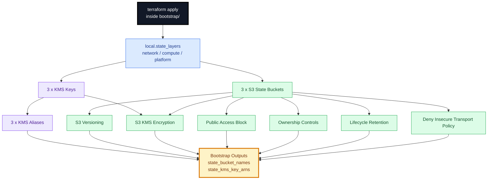

Terraform may create independent items concurrently.

It does not necessarily create KMS 1, then bucket 1, then KMS 2, etc.

`for_each` expands the resource block into multiple resource instances.

---

# 11. After Bootstrap: Production Network Runs First

Directory:

`environments/prod/network`

The production values are:

```text
project_name = openhelp
environment  = prod
region       = us-east-1

VPC:
10.20.0.0/16

Availability Zones:
us-east-1a
us-east-1b

Public subnets:
10.20.1.0/24
10.20.2.0/24

Private subnets:
10.20.3.0/24
10.20.4.0/24

VPC endpoints:
enabled

VPC Flow Logs:
enabled

Flow log retention:
90 days
```

---

# 12. Production Network Root Module

The root `main.tf` creates:

```text
local.cluster_name
local.common_tags
module "vpc"
check "subnet_shape"
```

`cluster_name` becomes:

```text
openhelp-prod-eks
```

The root module calls:

```text
../../../modules/vpc
```

and passes production values into it.

---

# 13. Network Variable Flow

```mermaid
flowchart LR

    TFV["prod/network/terraform.tfvars"]

    ROOTVAR["prod/network/variables.tf"]

    MAIN["prod/network/main.tf"]

    MODVAR["modules/vpc/variables.tf"]

    MODMAIN["modules/vpc/main.tf"]

    AWS["AWS Network Resources"]

    OUT1["modules/vpc/outputs.tf"]

    OUT2["prod/network/outputs.tf"]

    TF_STATE_NODE[("prod/network/terraform.tfstate")]

    ROOTVAR --> MAIN
    TFV -->|"actual prod values"| ROOTVAR

    MAIN -->|"module arguments"| MODVAR
    MODVAR --> MODMAIN
    MODMAIN --> AWS
    AWS --> OUT1
    OUT1 --> OUT2
    OUT2 --> TF_STATE_NODE

    classDef cls_tfvars fill:#fef3c7,color:#78350f,stroke:#d97706
    classDef cls_root fill:#dbeafe,color:#1e3a8a,stroke:#2563eb
    classDef cls_child fill:#dcfce7,color:#14532d,stroke:#16a34a
    classDef cls_aws fill:#fee2e2,color:#7f1d1d,stroke:#dc2626
    classDef cls_state fill:#ede9fe,color:#4c1d95,stroke:#7c3aed

    class TFV cls_tfvars
    class ROOTVAR,MAIN,OUT2 cls_root
    class MODVAR,MODMAIN,OUT1 cls_child
    class AWS cls_aws
    class TF_STATE_NODE cls_state
```

---

# 14. Inside `modules/vpc`: How Two AZs Are Built

The module creates an `az_map`.

Conceptually:

```text
us-east-1a
    public_cidr  = 10.20.1.0/24
    private_cidr = 10.20.3.0/24

us-east-1b
    public_cidr  = 10.20.2.0/24
    private_cidr = 10.20.4.0/24
```

Resources using:

`for_each = local.az_map`

become one instance per AZ.

Therefore Terraform creates:

- 2 public subnets
- 2 private subnets
- 2 EIPs
- 2 NAT Gateways
- 2 private route tables
- associations per AZ

---

# 15. Network Resource Dependency Order

A useful conceptual graph is:

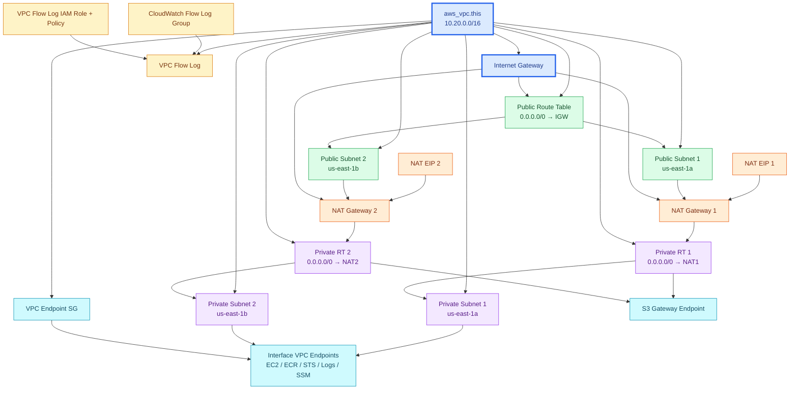

This is not necessarily a single serial list.

For example, after the VPC exists, Terraform can create several subnets and related independent resources in parallel.

---

# 16. Network Outputs — The Handoff to the Next Layers

The VPC child module exports:

```text
vpc_id
vpc_cidr
public_subnet_ids
private_subnet_ids
nat_gateway_ids
nat_gateway_public_ips
public_route_table_id
private_route_table_ids
vpc_endpoint_ids
```

The prod network root module re-exports them.

They are stored in:

```text
s3://openhelp-terraform-network-state-5739c46b679a/
    prod/network/terraform.tfstate
```

This state is what compute and platform read later.

---

# 17. Production Compute Runs Second

Directory:

`environments/prod/compute`

Before it creates anything, its configuration reads:

```text
data "terraform_remote_state" "network"
```

from:

```text
Bucket:
openhelp-terraform-network-state-5739c46b679a

Key:
prod/network/terraform.tfstate
```

This is the main connection:

```text
NETWORK
   ↓ outputs
S3 NETWORK STATE
   ↓ terraform_remote_state
COMPUTE
```

---

# 18. Exactly What Compute Reads from Network

Compute directly uses:

```text
network.outputs.vpc_id
network.outputs.public_subnet_ids[0]
network.outputs.public_subnet_ids[1]
```

These are passed as:

```text
vpc_id
public_subnet_id
tools_public_subnet_id
```

Therefore:

```text
Bastion EC2
    → Public Subnet 1

Jenkins/SonarQube EC2
    → Public Subnet 2
```

---

# 19. Compute Production Values

The prod compute tfvars currently set:

```text
admin_cidr_blocks = 217.119.64.150/32

ami_id = ""
key_name = openhelp-key

create_bastion    = true
create_tools_host = true

bastion_instance_type = m7i-flex.large
tools_instance_type   = m7i-flex.large

termination_protection = false
detailed_monitoring    = true

bastion root disk = 30 GiB
tools root disk   = 100 GiB
```

Because `ami_id = ""`, the EC2 module performs an AMI data lookup.

It selects the latest matching Canonical Ubuntu 24.04 amd64 gp3 image.

---

# 20. Compute Root Module Calls Three Child Modules

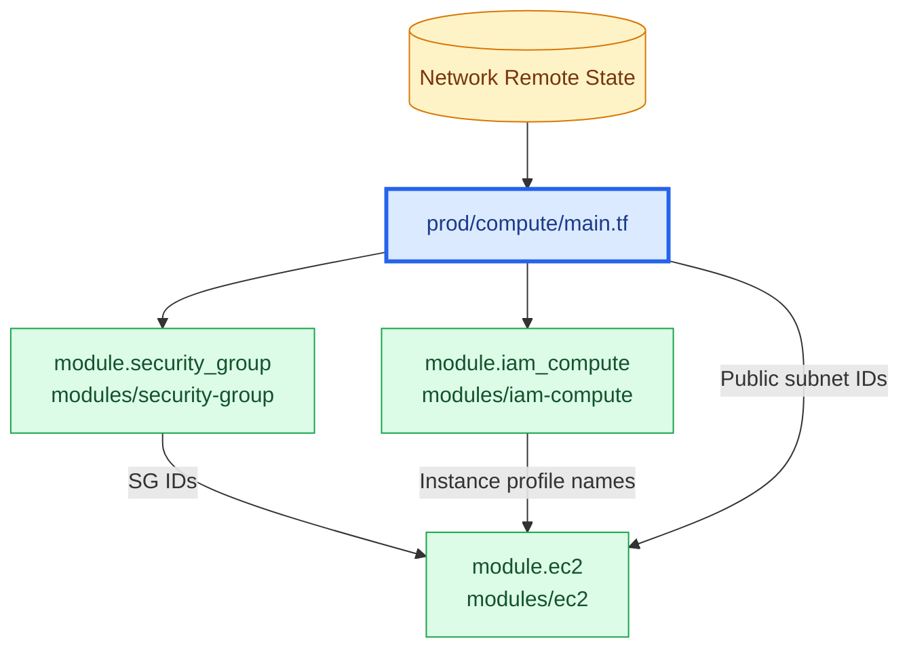

The modules `security_group` and `iam_compute` do not depend on one another.

Terraform can therefore work on them concurrently.

The EC2 module explicitly has:

```text
depends_on = [
  module.iam_compute,
  module.security_group
]
```

and it also references outputs from both.

Therefore EC2 waits for them.

---

# 21. `modules/security-group`

It creates two security groups.

## Bastion security group

Inbound:

```text
22/tcp from 217.119.64.150/32
```

Outbound:

```text
all
```

## Tools security group

Inbound:

```text
22/tcp   SSH
8080/tcp Jenkins
9000/tcp SonarQube
```

All restricted to:

```text
217.119.64.150/32
```

Outbound:

```text
all
```

Outputs:

```text
bastion_security_group_id
tools_security_group_id
```

Those IDs are passed into `module.ec2`.

---

# 22. `modules/iam-compute`

This module creates:

## Bastion IAM

```text
EC2 trust policy
    ↓
Bastion IAM role
    ├── AmazonSSMManagedInstanceCore
    ├── eks:DescribeCluster
    └── EC2 Describe permissions
    ↓
Bastion instance profile
```

## Tools IAM

```text
EC2 trust policy
    ↓
Tools IAM role
    ├── AmazonSSMManagedInstanceCore
    ├── eks:DescribeCluster
    ├── ECR login
    └── Push/Pull ECR repositories under openhelp/prod/*
    ↓
Tools instance profile
```

Outputs:

```text
bastion_instance_profile_name
bastion_role_arn
tools_instance_profile_name
tools_role_arn
```

The profile names go to EC2.

The role ARNs are later written into compute state and consumed by platform/EKS.

---

# 23. `modules/ec2`

First, because prod has:

```text
ami_id = ""
```

Terraform executes the data source:

```text
data.aws_ami.ubuntu
```

It searches for the latest Ubuntu 24.04 amd64 server AMI.

Then:

```text
local.selected_ami_id
```

gets that AMI ID.

---

# 24. EC2 Resource Flow

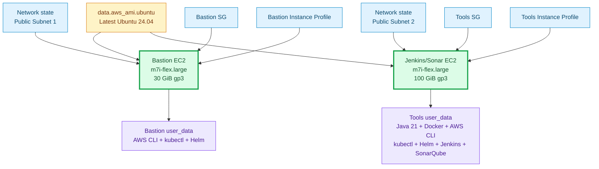

The tools user data installs and starts:

- Docker
- Java 21
- Jenkins
- SonarQube container
- AWS CLI
- kubectl
- Helm

---

# 25. Compute Outputs — Handoff to Platform

The compute root stores:

```text
bastion_instance_id
bastion_public_ip

tools_instance_id
tools_public_ip
tools_private_ip

bastion_role_arn
tools_role_arn

bastion_security_group_id
tools_security_group_id

selected_ami_id
```

in:

```text
prod/compute/terraform.tfstate
```

Platform later reads four especially important values:

```text
bastion_role_arn
tools_role_arn
bastion_security_group_id
tools_security_group_id
```

---

# 26. Production Platform Runs Third

Directory:

`environments/prod/platform`

This root module reads **two remote states**:

```text
network state
compute state
```

That is why platform must come after both.

---

# 27. Platform Cross-State Data Flow

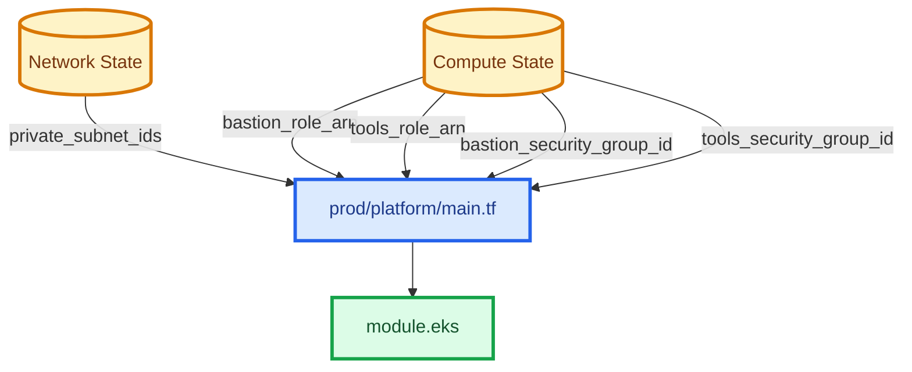

---

# 28. Platform Production Values

Important prod values currently include:

```text
EKS cluster:
openhelp-prod-eks

Kubernetes:
1.36

Endpoint public access:
true

Endpoint private access:
true

Allowed public CIDR:
217.119.64.150/32

Deletion protection:
false

Control-plane log retention:
90 days
```

Worker nodes:

```text
instance type: m7i-flex.large
capacity: ON_DEMAND

desired: 4
minimum: 2
maximum: 8

root disk:
80 GiB gp3
3000 IOPS
125 MiB/s throughput
```

The platform also creates 11 application ECR repositories.

---

# 29. Platform Root Calls Four Child Modules

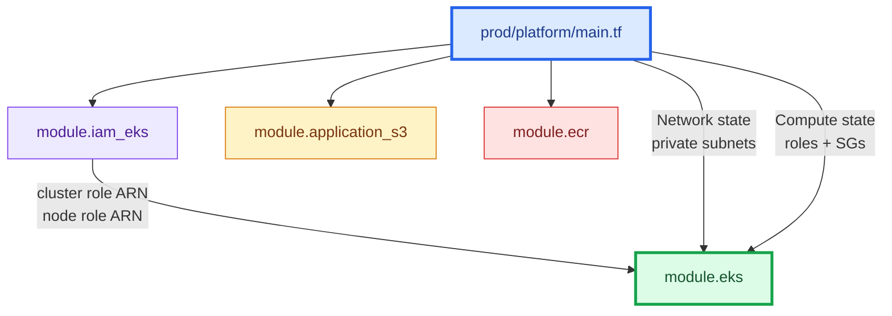

An important detail:

`iam_eks`, `application_s3`, and `ecr` do not depend on each other.

Terraform may create resources inside those modules in parallel.

The EKS module has an explicit dependency on:

`module.iam_eks`

so the cluster IAM roles exist before EKS proceeds.

---

# 30. `modules/iam-eks`

It builds two major IAM roles.

## EKS cluster role

Trust:

```text
eks.amazonaws.com
```

Policy:

```text
AmazonEKSClusterPolicy
```

Output:

```text
eks_cluster_role_arn
```

## EKS node role

Trust:

```text
ec2.amazonaws.com
```

Policies:

```text
AmazonEKSWorkerNodePolicy
AmazonEC2ContainerRegistryPullOnly
AmazonSSMManagedInstanceCore
```

Output:

```text
eks_node_role_arn
```

Those role ARNs feed directly into `module.eks`.

---

# 31. `modules/ecr`

The module first creates:

```text
KMS key
    ↓
KMS alias
```

Then 11 ECR repositories are generated with `for_each`.

Production repository names are:

```text
openhelp/prod/adservice
openhelp/prod/cartservice
openhelp/prod/checkoutservice
openhelp/prod/currencyservice
openhelp/prod/emailservice
openhelp/prod/frontend
openhelp/prod/loadgenerator
openhelp/prod/paymentservice
openhelp/prod/productcatalogservice
openhelp/prod/recommendationservice
openhelp/prod/shippingservice
```

Each repository has:

- immutable image tags
- KMS encryption
- image scanning on push
- force delete enabled in prod tfvars
- lifecycle cleanup

Then Terraform creates one lifecycle policy per repository.

---

# 32. ECR Dependency Flow

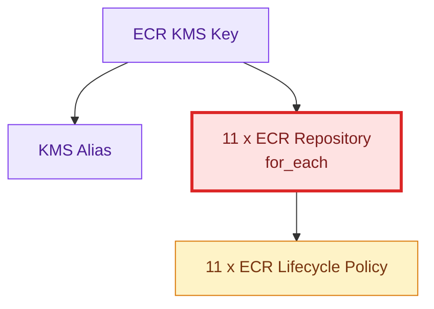

---

# 33. `modules/s3`

This creates two application buckets.

The names are generated from:

```text
project
environment
AWS account ID
```

Result pattern:

```text
openhelp-prod-<account-id>-app-bucket1
openhelp-prod-<account-id>-app-bucket2
```

The module creates:

- application KMS key
- KMS alias
- 2 S3 buckets
- versioning
- KMS encryption
- public-access blocking
- ownership controls
- lifecycle retention
- TLS-only bucket policy

---

# 34. Application S3 Flow

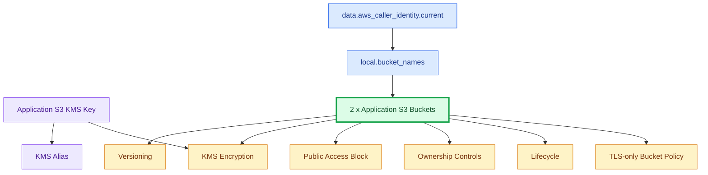

---

# 35. `modules/eks` — The Most Complex Module

This module creates:

- KMS key for Kubernetes secrets
- CloudWatch control-plane log group
- EKS control plane
- EKS API SG access rules
- OIDC provider
- VPC CNI IAM role with IRSA
- VPC CNI add-on
- worker-node launch template
- managed node group
- kube-proxy
- CoreDNS
- EKS Pod Identity Agent
- EBS CSI IAM role
- EBS CSI Pod Identity association
- EBS CSI add-on
- EKS access entries
- access-policy associations

---

# 36. EKS High-Level Execution Graph

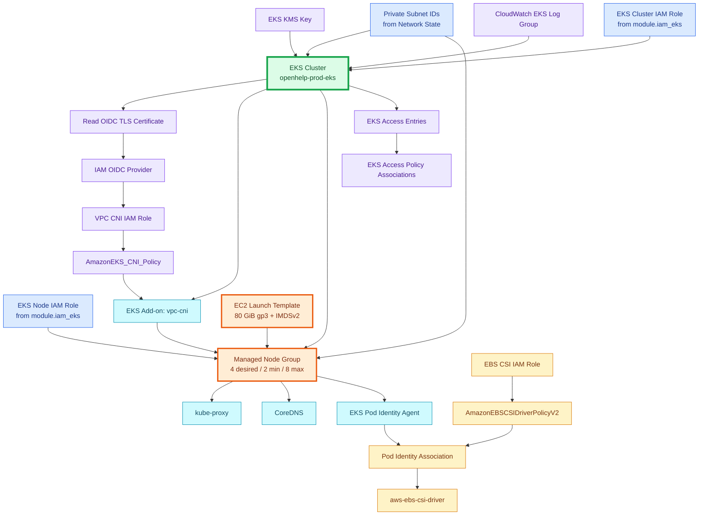

---

# 37. EKS Cluster Creation

The cluster is created only when its prerequisites are available.

Important inputs:

```text
name:
openhelp-prod-eks

role ARN:
module.iam_eks.eks_cluster_role_arn

version:
1.36

subnets:
network remote state private_subnet_ids

KMS:
aws_kms_key.eks

logs:
CloudWatch log group
```

Endpoint configuration:

```text
private access = true
public access  = true

public CIDR:
217.119.64.150/32
```

Control plane logging:

```text
api
audit
authenticator
controllerManager
scheduler
```

---

# 38. Why EKS Uses the Private Subnets

Platform reads:

```text
data.terraform_remote_state.network.outputs.private_subnet_ids
```

and passes them to EKS as:

```text
private_subnet_ids
```

The EKS cluster VPC configuration uses them.

The managed node group also uses them.

Therefore worker nodes are not created in:

```text
10.20.1.0/24
10.20.2.0/24
```

They are created in:

```text
10.20.3.0/24
10.20.4.0/24
```

---

# 39. EKS OIDC and VPC CNI IRSA

After the cluster exists, it exposes an OIDC issuer URL.

Terraform then follows:

```text
EKS cluster
   ↓
OIDC issuer URL
   ↓
TLS certificate data source
   ↓
IAM OIDC provider
   ↓
VPC CNI IAM role trust policy
   ↓
AmazonEKS_CNI_Policy
   ↓
vpc-cni managed add-on
```

The VPC CNI role is scoped so the federated subject is:

```text
system:serviceaccount:kube-system:aws-node
```

---

# 40. Worker Node Creation

The node launch template defines:

```text
IMDSv2 required

root EBS:
gp3
80 GiB
3000 IOPS
125 throughput
encrypted
delete on termination
```

Then the managed node group uses:

```text
cluster:
openhelp-prod-eks

role:
EKS node IAM role

subnets:
private subnet 1 + private subnet 2

instance type:
m7i-flex.large

capacity:
ON_DEMAND

desired:
4

min:
2

max:
8
```

The node group explicitly waits for the VPC CNI add-on.

---

# 41. Why CoreDNS and kube-proxy Come After Nodes

The module contains explicit dependencies making:

```text
node group
   ↓
kube-proxy

node group
   ↓
CoreDNS

node group
   ↓
EKS Pod Identity Agent
```

This ensures worker capacity is established before these node-dependent add-ons are finalized.

---

# 42. EBS CSI Dependency Chain

This is a useful example of Terraform dependencies.

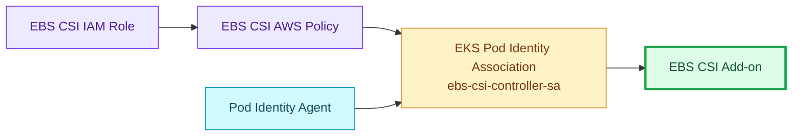

The association connects:

```text
namespace:
kube-system

service account:
ebs-csi-controller-sa

IAM role:
openhelp-prod-ebs-csi-role
```

Only after that association exists does the EBS CSI add-on proceed.

---

# 43. Bastion and Tools Access to EKS

Platform reads compute state:

```text
bastion_role_arn
tools_role_arn
```

The EKS module builds access entries.

Conceptually:

```text
Bastion IAM Role
    ↓
EKS Access Entry
    ↓
AmazonEKSClusterAdminPolicy

Tools IAM Role
    ↓
EKS Access Entry
    ↓
AmazonEKSEditPolicy
```

It also reads:

```text
bastion_security_group_id
tools_security_group_id
```

and creates EKS cluster-security-group rules allowing TCP 443 from those security groups to the EKS API.

---

# 44. Full Cross-Layer Value Passing

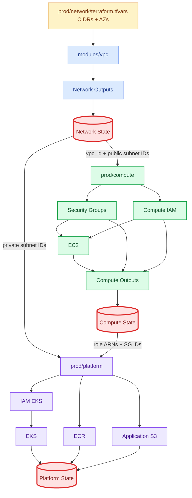

---

# 45. The Three Production States Are Deliberate

This project does not have one giant prod state.

It has:

```text
prod/network
prod/compute
prod/platform
```

Why?

Because the layers have different lifecycles.

For example:

- Updating EKS should not require owning VPC state.
- Updating Jenkins EC2 should not require owning the entire EKS state.
- Destroying platform first removes EKS dependencies before attempting to remove the VPC.

This is separation of responsibility.

---

# 46. Why Remote State Is Used

Consider compute needing a VPC ID.

The VPC was created by another root module.

Compute cannot simply write:

```text
module.vpc.vpc_id
```

because `module.vpc` exists in another root configuration and another Terraform run.

Instead:

```text
Network root
   ↓
output "vpc_id"
   ↓
Network state in S3
   ↓
terraform_remote_state
   ↓
Compute root
```

Same for platform.

---

# 47. Exact Production State Relationships

```text
NETWORK STATE
prod/network/terraform.tfstate
    |
    +--> vpc_id --------------------------> compute
    |
    +--> public_subnet_ids ---------------> compute EC2
    |
    +--> private_subnet_ids --------------> platform EKS


COMPUTE STATE
prod/compute/terraform.tfstate
    |
    +--> bastion_role_arn ----------------> EKS access
    |
    +--> tools_role_arn ------------------> EKS access
    |
    +--> bastion_security_group_id -------> EKS API SG rule
    |
    +--> tools_security_group_id ---------> EKS API SG rule


PLATFORM STATE
prod/platform/terraform.tfstate
    |
    +--> EKS identity
    +--> node group
    +--> ECR repositories
    +--> application S3 bucket names
```

---

# 48. What `terraform init -reconfigure` Does Here

Inside each root directory, the PowerShell script first runs:

```text
terraform init -reconfigure
```

Conceptually, init prepares:

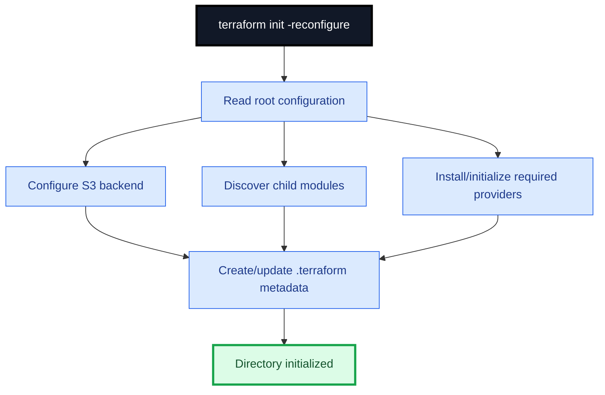

`-reconfigure` tells Terraform to reconfigure the backend instead of relying on prior backend initialization metadata.

---

# 49. What `terraform fmt -check` Does

This is formatting validation.

It does not create AWS resources.

It checks whether the Terraform source is formatted according to Terraform's canonical style.

If formatting is wrong, the script stops because:

```powershell
$ErrorActionPreference = "Stop"
```

---

# 50. What `terraform validate` Does

Validation checks configuration consistency.

Examples:

- invalid references
- wrong arguments
- wrong value types
- missing required module arguments
- syntax/configuration problems

It does not create infrastructure.

---

# 51. What `terraform plan -out=tfplan` Does

This is where Terraform calculates the desired changes.

Conceptually:

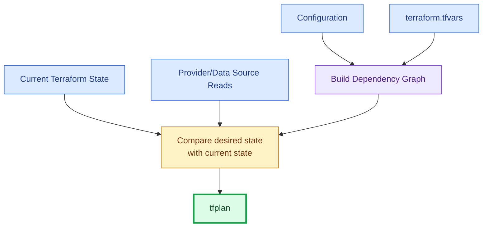

The saved plan file is:

`tfplan`

---

# 52. What `terraform apply tfplan` Does

Apply executes the already-calculated plan.

Terraform:

1. acquires the S3 state lock
2. follows the dependency graph
3. calls AWS APIs
4. waits for required resources
5. runs independent branches concurrently when possible
6. updates the Terraform state
7. releases the state lock
8. displays outputs

---

# 53. Terraform Does Not Simply Run Top-to-Bottom

Suppose the configuration contains:

```text
resource VPC

resource Subnet references VPC

resource SecurityGroup references VPC
```

The graph is:

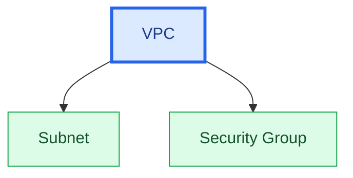

After the VPC exists, subnet and SG may be created at the same time.

That is normal Terraform behavior.

---

# 54. Implicit Dependencies

Terraform discovers an implicit dependency when one block references another.

Example from the VPC module:

```text
vpc_id = aws_vpc.this.id
```

This tells Terraform:

```text
aws_vpc.this
    must exist before
aws_subnet.public
```

You do not need:

`depends_on`

because the reference already creates the dependency.

---

# 55. Explicit Dependencies

Use `depends_on` when the dependency cannot be understood only from a data reference or when the code deliberately requires a stronger ordering relationship.

Example in compute:

```text
module "ec2" {
    depends_on = [
        module.iam_compute,
        module.security_group
    ]
}
```

Meaning:

```text
Do not begin EC2 module operations until these upstream modules are complete.
```

---

# 56. Examples of Explicit Dependencies in This Repository

### NAT Gateway

```text
depends_on = [aws_internet_gateway.this]
```

### EC2 module

```text
depends_on = [
  module.iam_compute,
  module.security_group
]
```

### EKS module from platform

```text
depends_on = [module.iam_eks]
```

### EKS cluster

```text
depends_on = [aws_cloudwatch_log_group.eks]
```

### VPC CNI add-on

```text
depends_on = [
  aws_iam_role_policy_attachment.vpc_cni
]
```

### Managed node group

```text
depends_on = [
  aws_eks_addon.vpc_cni
]
```

### CoreDNS / kube-proxy / Pod Identity Agent

They depend on the managed node group.

### EBS CSI

```text
Pod Identity Agent
     +
EBS IAM policy
     ↓
Pod Identity Association
     ↓
EBS CSI add-on
```

---

# 57. `for_each` — Why One Block Creates Many Resources

Example:

```text
resource "aws_ecr_repository" "this" {
    for_each = var.repository_names
}
```

`repository_names` contains 11 items.

Terraform expands the single resource block into 11 separate resource instances.

Similarly:

```text
for_each = local.az_map
```

in the VPC module creates per-AZ resources.

---

# 58. `count` — Conditional Resource Creation

The repository also uses `count`.

Example:

```text
count = var.create_bastion ? 1 : 0
```

Prod has:

```text
create_bastion = true
```

Therefore:

```text
count = 1
```

and the instance exists.

If false:

```text
count = 0
```

and Terraform creates no bastion instance.

The same pattern is used for:

- tools host
- VPC endpoints
- VPC flow logging resources
- EBS CSI resources
- optional EKS access-related resources

---

# 59. `locals` — Calculated Internal Values

A local is a calculated/reusable value inside a module.

Example:

```text
cluster_name =
"${var.project_name}-${var.environment}-eks"
```

With prod:

```text
project_name = openhelp
environment  = prod
```

result:

```text
openhelp-prod-eks
```

A local is not an external input.

It is computed from other known values.

---

# 60. `data` Blocks — Read Existing Information

Data sources query information instead of creating a new managed resource.

Examples in this repository:

```text
data.aws_caller_identity.current
```

asks AWS:

> Which AWS account is Terraform currently authenticated to?

```text
data.aws_ami.ubuntu
```

asks AWS:

> Which AMI matches the Ubuntu filters?

```text
data.terraform_remote_state.network
```

reads another Terraform root module's outputs.

```text
data.tls_certificate.eks_oidc
```

reads TLS certificate information from the EKS OIDC issuer.

---

# 61. Check Blocks

The repository also uses Terraform `check` blocks.

Network checks:

```text
exactly 2 public subnets
exactly 2 private subnets
exactly 2 AZs
```

Compute checks:

```text
remote network state must match:
project
environment
region
```

Platform checks:

```text
node_min <= node_desired <= node_max

network remote state must match prod

compute remote state must match prod
```

These checks help prevent accidentally wiring a prod layer to a dev/test state.

---

# 62. End-to-End Example: How One Value Travels

Take:

`private_subnet_ids`

## Stage 1

Prod tfvars provides:

```text
10.20.3.0/24
10.20.4.0/24
```

## Stage 2

Prod network root passes them to:

`modules/vpc`

## Stage 3

VPC module creates:

```text
aws_subnet.private["us-east-1a"]
aws_subnet.private["us-east-1b"]
```

## Stage 4

VPC outputs their generated AWS subnet IDs.

Example conceptually:

```text
subnet-AAA
subnet-BBB
```

## Stage 5

Prod network root exports:

`private_subnet_ids`

## Stage 6

They are stored in network S3 state.

## Stage 7

Platform reads them through:

`terraform_remote_state.network`

## Stage 8

Platform passes them into:

`module.eks`

## Stage 9

EKS uses them for:

```text
EKS VPC configuration
managed node group
```

This is exactly how data moves through modular Terraform.

---

# 63. Complete Input → Module → AWS → Output Pattern

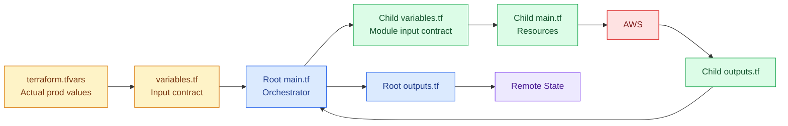

---

# 64. Why This Repository Is Modular

Without modules, dev/test/prod would repeat large amounts of AWS resource code.

Instead:

```text
modules/vpc
```

contains reusable network implementation.

Then:

```text
environments/dev/network
environments/test/network
environments/prod/network
```

provide different values.

Same reusable implementation:

```text
VPC module
```

Different input:

```text
dev  → 10.0.0.0/16
test → 10.10.0.0/16
prod → 10.20.0.0/16
```

This is one of the main benefits of Terraform modules.

---

# 65. Root Module vs Child Module

When you run:

```text
cd environments/prod/network
terraform plan
```

then:

```text
environments/prod/network
```

is the **root module**.

`modules/vpc`

is a **child module** because the root explicitly calls it.

If you instead manually `cd modules/vpc` and run Terraform there, you would be treating that directory as a root configuration — which is not the intended production workflow.

---

# 66. Files Terraform Will NOT Automatically Traverse

Terraform does **not** recursively process every directory in the repository.

If you run from:

`environments/prod/network`

Terraform does not automatically execute:

```text
../compute
../platform
../../../modules/ec2
../../../modules/eks
```

The VPC module is loaded only because network `main.tf` explicitly contains:

```text
module "vpc" {
    source = "../../../modules/vpc"
}
```

The compute and platform roots are executed later by the PowerShell wrapper.

---

# 67. Why Network Must Be Before Compute

Compute needs:

```text
vpc_id
public_subnet_ids
```

Those do not exist until network is applied.

So:

```text
network → compute
```

is a hard architectural dependency.

The PowerShell script enforces that cross-root ordering.

Terraform's graph only controls ordering **inside one Terraform root execution**.

It does not automatically build one giant graph across three separately executed state roots.

---

# 68. Why Compute Must Be Before Platform

Platform consumes:

```text
bastion_role_arn
tools_role_arn
bastion_security_group_id
tools_security_group_id
```

from compute remote state.

Therefore:

```text
compute → platform
```

must happen.

---

# 69. Two Types of Dependency in This Repository

## Inside one root/state

Terraform dependency graph handles it.

Example:

```text
VPC → subnet → NAT → private route
```

## Between different root states

The wrapper script + remote state architecture handles it.

Example:

```text
network state → compute
compute state → platform
```

This distinction is extremely important.

---

# 70. Full Production Apply Timeline

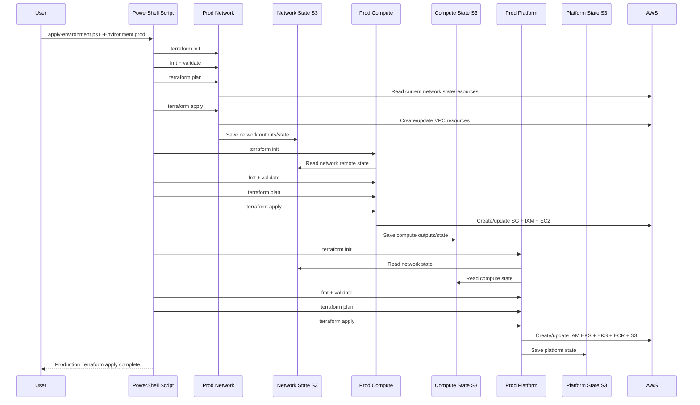

---

# 71. What Gets Created in Production — Summary

## Bootstrap

Shared state foundation:

```text
3 S3 state buckets
3 KMS keys
3 KMS aliases
state bucket protections/configuration
```

---

## Network

```text
1 VPC

2 public subnets
2 private subnets

1 Internet Gateway

2 NAT EIPs
2 NAT Gateways

1 public route table
2 private route tables

route associations

VPC endpoint security group

8 interface endpoint service types:
ec2
ec2messages
ecr.api
ecr.dkr
logs
ssm
ssmmessages
sts

1 S3 Gateway Endpoint

VPC Flow Log CloudWatch group
VPC Flow Log IAM role/policy
VPC Flow Log
```

---

## Compute

```text
Bastion security group
Tools security group

Bastion IAM role + profile
Tools IAM role + profile

Bastion EC2
Jenkins/SonarQube EC2

Ubuntu AMI lookup
```

---

## Platform

```text
EKS cluster IAM role
EKS worker-node IAM role

EKS KMS key
EKS control-plane CloudWatch Logs

EKS cluster
EKS OIDC provider

VPC CNI role + add-on
managed node launch template
managed node group

kube-proxy
CoreDNS
EKS Pod Identity Agent
EBS CSI role
EBS CSI Pod Identity association
EBS CSI add-on

EKS access entries
EKS access-policy associations

11 ECR repositories
ECR KMS key
ECR lifecycle policies

2 application S3 buckets
application S3 KMS key
bucket protections/versioning/lifecycle
```

---

# 72. Why Destroy Order Is the Reverse

Apply:

```text
network
   ↓
compute
   ↓
platform
```

Dependencies point upward.

Therefore safe destruction is:

```text
platform
   ↓
compute
   ↓
network
```

---

# 73. Destroy Flow

```mermaid
flowchart TD

    START["Destroy prod"]

    P["1. PLATFORM<br/>EKS + nodes + ECR + app S3"]

    C["2. COMPUTE<br/>Bastion + Jenkins/Sonar + IAM + SG"]

    N["3. NETWORK<br/>Endpoints + NAT + routes + subnets + VPC"]

    KEEP["Keep Bootstrap<br/>unless permanently deleting Terraform state foundation"]

    START --> P --> C --> N --> KEEP

    classDef cls_start fill:#111827,color:white,stroke:#000,stroke-width:3px
    classDef cls_danger fill:#fee2e2,color:#7f1d1d,stroke:#dc2626,stroke-width:3px
    classDef cls_keep fill:#dcfce7,color:#14532d,stroke:#16a34a,stroke-width:3px

    class START cls_start
    class P,C,N cls_danger
    class KEEP cls_keep
```

If network were destroyed first, AWS could still have:

- EKS ENIs
- node group resources
- EC2 instances
- security groups
- EKS networking
- load balancer-related network interfaces

using the VPC/subnets.

That is why reverse dependency order is used.

---

# 74. Beginner Analogy

Imagine building a house.

## Bootstrap

```text
Creates the filing cabinet where all construction records are stored.
```

## Network

```text
Buys the land and builds:
roads
entrances
utility paths
```

## Compute

```text
Builds administration/workshop buildings:
Bastion
Jenkins/SonarQube
```

## Platform

```text
Builds the Kubernetes factory:
EKS
worker nodes
container registry
application storage
```

You cannot place the workshop on a public subnet before the subnet exists.

You cannot place worker nodes in private subnets before those subnets exist.

That is what Terraform dependencies represent.

---

# 75. A Simple Rule for Reading Any Terraform Module

Whenever you open a Terraform directory, read it using this mental sequence:

### Question 1 — What variables exist?

Look at:

`variables.tf`

### Question 2 — What values does this environment provide?

Look at:

`terraform.tfvars`

### Question 3 — Which provider/backend is used?

Look at:

```text
provider.tf
backend.tf
versions.tf
```

### Question 4 — Which modules/resources are declared?

Look at:

`main.tf`

### Question 5 — Which child module does it call?

Look for:

```text
module "..." {
    source = "..."
}
```

### Question 6 — What goes into the child module?

Read the arguments inside the module block.

### Question 7 — What does the child create?

Open the child's:

`main.tf`

### Question 8 — What does it return?

Open:

`outputs.tf`

### Question 9 — Who consumes that output?

Search for:

```text
module.<name>.<output>
```

or:

```text
terraform_remote_state.<name>.outputs.<output>
```

That method works for almost any Terraform repository.

---

# 76. Production File-by-File Reading Order for a Human

Although Terraform does not execute files in filename order, **you** can read them in this order to understand them:

## Bootstrap

```text
1. bootstrap/versions.tf
2. bootstrap/variables.tf
3. bootstrap/terraform.tfvars
4. bootstrap/provider.tf
5. bootstrap/main.tf
6. bootstrap/outputs.tf
```

## Prod Network

```text
1. environments/prod/network/versions.tf
2. environments/prod/network/backend.tf
3. environments/prod/network/variables.tf
4. environments/prod/network/terraform.tfvars
5. environments/prod/network/provider.tf
6. environments/prod/network/main.tf
7. modules/vpc/variables.tf
8. modules/vpc/main.tf
9. modules/vpc/outputs.tf
10. environments/prod/network/outputs.tf
```

## Prod Compute

```text
1. environments/prod/compute/versions.tf
2. environments/prod/compute/backend.tf
3. environments/prod/compute/variables.tf
4. environments/prod/compute/terraform.tfvars
5. environments/prod/compute/provider.tf
6. environments/prod/compute/main.tf

7. modules/security-group/variables.tf
8. modules/security-group/main.tf
9. modules/security-group/outputs.tf

10. modules/iam-compute/variables.tf
11. modules/iam-compute/main.tf
12. modules/iam-compute/outputs.tf

13. modules/ec2/variables.tf
14. modules/ec2/main.tf
15. modules/ec2/outputs.tf

16. environments/prod/compute/outputs.tf
```

## Prod Platform

```text
1. environments/prod/platform/versions.tf
2. environments/prod/platform/backend.tf
3. environments/prod/platform/variables.tf
4. environments/prod/platform/terraform.tfvars
5. environments/prod/platform/provider.tf
6. environments/prod/platform/main.tf

7. modules/iam-eks/variables.tf
8. modules/iam-eks/main.tf
9. modules/iam-eks/outputs.tf

10. modules/ecr/variables.tf
11. modules/ecr/main.tf
12. modules/ecr/outputs.tf

13. modules/s3/variables.tf
14. modules/s3/main.tf
15. modules/s3/outputs.tf

16. modules/eks/variables.tf
17. modules/eks/main.tf
18. modules/eks/outputs.tf

19. environments/prod/platform/outputs.tf
```

This is a **recommended learning order**, not Terraform's runtime file order.

---

# 77. What Happens If You Run Terraform from the Wrong Directory?

If you run:

```text
terraform apply
```

from repository root, Terraform uses only the Terraform configuration directly in that working directory.

It does not automatically run:

```text
environments/prod/network
environments/prod/compute
environments/prod/platform
```

Your intended production command is the wrapper:

```powershell
./scripts/apply-environment.ps1 -Environment prod
```

or manual layer-by-layer commands from each specific prod directory.

---

# 78. Manual Production Apply

If you do not use the script:

## Network

```powershell
cd environments/prod/network

terraform init -reconfigure
terraform fmt -check
terraform validate
terraform plan -out=tfplan
terraform apply tfplan
```

## Compute

```powershell
cd ../compute

terraform init -reconfigure
terraform fmt -check
terraform validate
terraform plan -out=tfplan
terraform apply tfplan
```

## Platform

```powershell
cd ../platform

terraform init -reconfigure
terraform fmt -check
terraform validate
terraform plan -out=tfplan
terraform apply tfplan
```

---

# 79. How to See Terraform's Real Dependency Graph Yourself

Terraform provides:

```text
terraform graph
```

For a saved plan:

```text
terraform graph -plan=tfplan
```

If Graphviz is installed:

```text
terraform graph -plan=tfplan | dot -Tpng > graph.png
```

This gives you a machine-generated view of the dependencies Terraform has calculated.

This can be very useful while learning.

---

# 80. Production Flow in One Sentence

Remember:

> **Prod tfvars supplies values → prod root modules orchestrate reusable child modules → child modules create AWS resources → outputs are saved in separate S3 states → later prod layers read earlier state outputs → Terraform dependency graphs determine resource order inside each layer.**

---

# 81. The 10-Step Beginner Memory Map

```mermaid
flowchart LR

    A["1<br/>Choose prod"]
    B["2<br/>Load prod root"]
    C["3<br/>Read tfvars"]
    D["4<br/>Load child modules"]
    E["5<br/>Build dependency graph"]
    F["6<br/>Plan"]
    G["7<br/>Apply AWS resources"]
    H["8<br/>Generate outputs"]
    I["9<br/>Save S3 state"]
    J["10<br/>Next layer reads state"]

    A --> B --> C --> D --> E --> F --> G --> H --> I --> J

    classDef cls_one fill:#dbeafe,color:#1e3a8a,stroke:#2563eb
    classDef cls_two fill:#dcfce7,color:#14532d,stroke:#16a34a
    classDef cls_three fill:#fef3c7,color:#78350f,stroke:#d97706
    classDef cls_four fill:#ede9fe,color:#4c1d95,stroke:#7c3aed
    classDef cls_five fill:#fee2e2,color:#7f1d1d,stroke:#dc2626

    class A,B cls_one
    class C,D cls_two
    class E,F cls_three
    class G,H cls_four
    class I,J cls_five
```

---

# 82. Final Production Mental Model

```text
                         ┌───────────────────────┐
                         │       BOOTSTRAP       │
                         │ State S3 + State KMS  │
                         └───────────┬───────────┘
                                     │
                                     ▼
┌───────────────────────────────────────────────────────────┐
│ NETWORK ROOT                                              │
│ environments/prod/network                                 │
│                                                           │
│ terraform.tfvars → main.tf → modules/vpc                 │
│                                                           │
│ Creates VPC, 4 subnets, 2 NATs, routes, endpoints, logs  │
└──────────────────────────┬────────────────────────────────┘
                           │
                           ▼
                 NETWORK REMOTE STATE
                           │
            ┌──────────────┴───────────────┐
            │                              │
            ▼                              │
┌─────────────────────────────┐            │
│ COMPUTE ROOT                │            │
│ environments/prod/compute   │            │
│                             │            │
│ security-group              │            │
│ iam-compute                 │            │
│ ec2                         │            │
└──────────────┬──────────────┘            │
               │                           │
               ▼                           │
        COMPUTE REMOTE STATE               │
               │                           │
               └──────────────┬────────────┘
                              │
                              ▼
┌───────────────────────────────────────────────────────────┐
│ PLATFORM ROOT                                             │
│ environments/prod/platform                                │
│                                                           │
│ iam-eks + ecr + s3 + eks                                 │
│                                                           │
│ Creates EKS, workers, add-ons, 11 ECR repos, 2 S3 buckets│
└──────────────────────────┬────────────────────────────────┘
                           │
                           ▼
                  PLATFORM REMOTE STATE
```

---

# 83. Key Questions and Answers

## Which Terraform file is called first?

There is no normal first `.tf` file such as `main.tf`.

Terraform loads the configuration files in the current root module together.

`terraform init` initializes the backend, modules, and providers; `plan` evaluates the configuration and builds the dependency graph.

---

## Then why do we have `main.tf`, `variables.tf`, etc.?

For human organization and maintainability.

The filenames communicate purpose.

---

## What actually controls resource creation order?

Primarily:

1. references between resources/modules
2. explicit `depends_on`
3. provider/API requirements
4. Terraform's dependency graph

---

## What controls network → compute → platform order?

The repository's:

`scripts/apply-environment.ps1`

It explicitly loops:

```text
network
compute
platform
```

---

## How does compute know the VPC ID?

Through:

```text
network outputs
     ↓
network S3 state
     ↓
terraform_remote_state.network
     ↓
compute main.tf
```

---

## How does platform know the private subnet IDs?

Through network remote state.

---

## How does platform know the bastion/tools IAM role ARNs?

Through compute remote state.

---

## Why is bootstrap not part of every prod apply?

Because it creates the persistent remote-state foundation.

Normally it is provisioned once and kept.

---

## Does Terraform execute all child modules sequentially?

No.

Independent modules/resources may proceed concurrently.

Dependencies determine what must wait.

---

## Does the position of a block in `main.tf` control AWS creation order?

No.

References/dependencies do.

---

# 84. Research Basis

This guide was produced by reviewing the current repository's production Terraform source, including:

- `bootstrap/`
- `environments/prod/network/`
- `environments/prod/compute/`
- `environments/prod/platform/`
- `modules/vpc/`
- `modules/security-group/`
- `modules/iam-compute/`
- `modules/ec2/`
- `modules/iam-eks/`
- `modules/eks/`
- `modules/ecr/`
- `modules/s3/`
- `scripts/apply-environment.ps1`

Terraform behavior described here was cross-checked against HashiCorp's official documentation covering:

- Terraform files and configuration structure
- modules
- input variables and outputs
- dependency graphs
- implicit and explicit dependencies
- `terraform_remote_state`
- S3 backends and native lockfiles
- `terraform init`
- `terraform graph`

Repository:

`https://github.com/openhelpdevops/devops_project5_microservices-e-commerce-eks-project`

Official Terraform documentation:

`https://developer.hashicorp.com/terraform/language/files`

`https://developer.hashicorp.com/terraform/language/modules`

`https://developer.hashicorp.com/terraform/tutorials/configuration-language/dependencies`

`https://developer.hashicorp.com/terraform/language/backend/s3`

`https://developer.hashicorp.com/terraform/cli/commands/init`

`https://developer.hashicorp.com/terraform/cli/commands/graph`

---

# 85. Final Cheat Sheet

```text
PROD APPLY
==========

Prerequisite:
bootstrap already applied

Command:
./scripts/apply-environment.ps1 -Environment prod


LAYER 1
-------
environments/prod/network

Inputs:
terraform.tfvars

Calls:
modules/vpc

Creates:
VPC
2 public subnets
2 private subnets
IGW
2 NATs
routes
VPC endpoints
flow logs

Writes:
prod/network/terraform.tfstate


LAYER 2
-------
environments/prod/compute

Reads:
prod/network/terraform.tfstate

Calls:
modules/security-group
modules/iam-compute
modules/ec2

Creates:
bastion SG
tools SG
bastion IAM
tools IAM
bastion EC2
Jenkins/Sonar EC2

Writes:
prod/compute/terraform.tfstate


LAYER 3
-------
environments/prod/platform

Reads:
prod/network/terraform.tfstate
prod/compute/terraform.tfstate

Calls:
modules/iam-eks
modules/s3
modules/ecr
modules/eks

Creates:
EKS
node group
EKS add-ons
EKS IAM/access
11 ECR repositories
2 application S3 buckets

Writes:
prod/platform/terraform.tfstate


SAFE DESTROY
============

platform
↓
compute
↓
network

Bootstrap remains unless the entire Terraform state foundation is being permanently removed.
```
