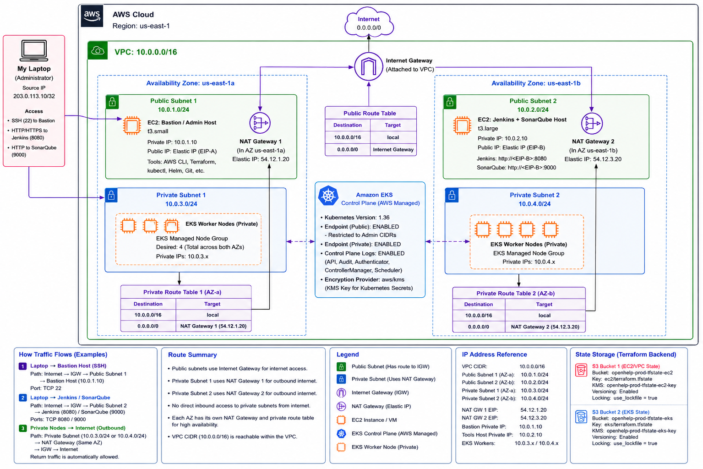
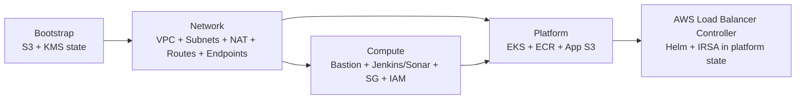
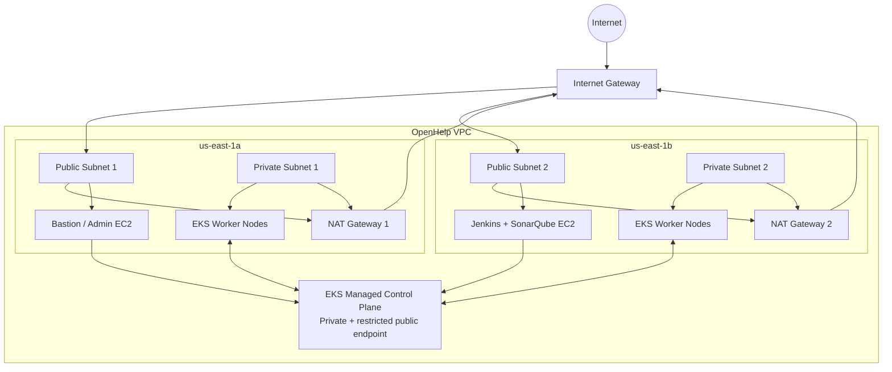

# OpenHelp AWS Terraform - Enterprise-Ready Multi-Environment Baseline

This repository provisions the OpenHelp AWS platform in `us-east-1` for three isolated environments:

- `dev`
- `test`
- `prod`

Each environment follows the same two-AZ architecture shown in the supplied reference diagram:

- 1 VPC
- 2 public subnets across `us-east-1a` and `us-east-1b`
- 2 private subnets across `us-east-1a` and `us-east-1b`
- 1 Internet Gateway
- 2 public NAT Gateways, one per AZ
- 1 public route table
- 2 private route tables, each using the NAT Gateway in the same AZ
- Bastion/Admin EC2 in Public Subnet 1
- Jenkins + SonarQube EC2 in Public Subnet 2
- EKS managed worker nodes only in private subnets
- EKS control-plane logging to CloudWatch
- KMS encryption for EKS secrets, ECR, application S3 and Terraform state
- VPC Flow Logs
- S3 remote state locking with native S3 lock files (`use_lockfile = true`)
- VPC endpoints for S3, ECR, STS, CloudWatch Logs, EC2 and SSM-related services

The original single-NAT dev/test design has been removed. **Dev, test and prod all use two NAT Gateways.**



## Repository layout

```text
openhelp-terraform-enterprise-ready-final/
├── bootstrap/
├── environments/
│   ├── dev/
│   │   ├── network/
│   │   ├── compute/
│   │   ├── platform/
│   ├── test/
│   │   ├── network/
│   │   ├── compute/
│   │   ├── platform/
│   └── prod/
│       ├── network/
│       ├── compute/
│       ├── platform/
├── modules/
│   ├── ec2/
│   ├── ecr/
│   ├── eks/
│   ├── iam-compute/
│   ├── iam-eks/
│   ├── s3/
│   ├── security-group/
│   └── vpc/
├── scripts/
│   ├── apply-environment.ps1
│   └── destroy-environment.ps1
├── ENTERPRISE_TERRAFORM_GUIDE.md
└── VALIDATION_REPORT.md
```

## Environment addressing

| Environment | VPC | Public Subnet 1 | Public Subnet 2 | Private Subnet 1 | Private Subnet 2 | NAT Gateways |
|---|---|---|---|---|---|---|
| dev | `10.0.0.0/16` | `10.0.1.0/24` | `10.0.2.0/24` | `10.0.3.0/24` | `10.0.4.0/24` | 2 |
| test | `10.10.0.0/16` | `10.10.1.0/24` | `10.10.2.0/24` | `10.10.3.0/24` | `10.10.4.0/24` | 2 |
| prod | `10.20.0.0/16` | `10.20.1.0/24` | `10.20.2.0/24` | `10.20.3.0/24` | `10.20.4.0/24` | 2 |

## Terraform state design

The bootstrap layer creates three shared state buckets, with a separate state object per environment and layer:

| Layer | Bucket | Example prod key |
|---|---|---|
| network | `openhelp-terraform-network-state-5739c46b679a` | `prod/network/terraform.tfstate` |
| compute | `openhelp-terraform-compute-state-5739c46b679a` | `prod/compute/terraform.tfstate` |
| platform | `openhelp-terraform-platform-state-5739c46b679a` | `prod/platform/terraform.tfstate` |

Backends use:

- S3 versioning
- SSE-KMS
- explicit KMS alias ARN
- `use_lockfile = true`
- TLS-only bucket policies
- public access blocking

DynamoDB locking is intentionally not used. Modern Terraform supports native S3 lock files, and DynamoDB-based locking is deprecated.

## Dependency model



Creation order:

`bootstrap -> network -> compute -> platform`

Destroy order:

`platform -> compute -> network`

Destroy bootstrap only when permanently removing the Terraform state foundation.

## Network architecture



## Before the first apply

1. Install Terraform 1.10 or later. The configuration uses native S3 state locking.
2. Configure AWS credentials and verify the identity:

   `aws sts get-caller-identity`

3. Confirm you are using AWS account `720973523623`. The backend KMS alias ARNs are currently written for this account.
4. Run the bootstrap first.
5. Confirm `admin_cidr_blocks` and EKS `public_access_cidrs` are your approved administrator/VPN `/32` or corporate CIDRs. Do not use `0.0.0.0/0`.
6. Confirm the EC2 key pair `openhelp-key` exists if SSH is required. If `key_name = ""`, use SSM Session Manager instead.

## Bootstrap

From `bootstrap`:

`terraform init`

`terraform fmt -check`

`terraform validate`

`terraform plan`

`terraform apply`

## Apply one environment manually

Example for prod:

### 1. Network

`cd environments/prod/network`

`terraform init -reconfigure`

`terraform fmt -check`

`terraform validate`

`terraform plan`

`terraform apply`

### 2. Compute

`cd ../compute`

`terraform init -reconfigure`

`terraform fmt -check`

`terraform validate`

`terraform plan`

`terraform apply`

### 3. Platform

`cd ../platform`

`terraform init -reconfigure`

`terraform fmt -check`

`terraform validate`

`terraform plan`

`terraform apply`

## Apply using PowerShell

From the repository root:

`./scripts/apply-environment.ps1 -Environment dev`

`./scripts/apply-environment.ps1 -Environment test`

`./scripts/apply-environment.ps1 -Environment prod`

The script always applies in dependency order: network, compute, platform.

## Safe destroy

Do not destroy the VPC first. EKS, ENIs, load balancers, EC2 instances and security groups can still be using the subnets/VPC.

Use:

`./scripts/destroy-environment.ps1 -Environment prod`

The script destroys in this order:

1. platform
2. compute
3. network

This ordering is the main protection against long-running subnet/security-group/VPC destroy failures.


## 16. Install Argo CD

For reproducible production installation, pin a reviewed Argo CD release instead of permanently relying on an unpinned URL.

The common stable installation command is:

```bash
kubectl apply --server-side --force-conflicts \
  -n argocd \
  -f https://raw.githubusercontent.com/argoproj/argo-cd/stable/manifests/install.yaml
```

Wait for all deployments:

```bash
kubectl rollout status deployment/argocd-server -n argocd --timeout=300s
kubectl rollout status deployment/argocd-repo-server -n argocd --timeout=300s
kubectl rollout status deployment/argocd-applicationset-controller -n argocd --timeout=300s
```

Wait for the application controller StatefulSet:

```bash
kubectl rollout status statefulset/argocd-application-controller \
  -n argocd \
  --timeout=300s
```

---

## 17. Verify Argo CD resources

To list the main workload resources:

```bash

root@kube:~# kubectl get all -n argocd
NAME                                                    READY   STATUS    RESTARTS       AGE
pod/argocd-application-controller-0                     1/1     Running   0              3m27s
pod/argocd-applicationset-controller-7f7b6c9856-xmgts   1/1     Running   0              3m32s
pod/argocd-dex-server-6b857cf79c-bfxwr                  1/1     Running   1 (118s ago)   3m32s
pod/argocd-notifications-controller-5f5fbbbd8-mszsp     1/1     Running   0              3m32s
pod/argocd-redis-65fc4c87dc-tgb6g                       1/1     Running   0              3m31s
pod/argocd-repo-server-7c4b587448-v6tmk                 1/1     Running   0              3m30s
pod/argocd-server-767dfcb8f9-mr48w                      1/1     Running   0              3m29s

NAME                                              TYPE        CLUSTER-IP       EXTERNAL-IP   PORT(S)                      AGE
service/argocd-applicationset-controller          ClusterIP   10.101.41.212    <none>        7000/TCP,8080/TCP            3m34s
service/argocd-dex-server                         ClusterIP   10.102.21.19     <none>        5556/TCP,5557/TCP,5558/TCP   3m34s
service/argocd-metrics                            ClusterIP   10.107.251.144   <none>        8082/TCP                     3m34s
service/argocd-notifications-controller-metrics   ClusterIP   10.109.206.158   <none>        9001/TCP                     3m34s
service/argocd-redis                              ClusterIP   10.101.207.149   <none>        6379/TCP                     3m33s
service/argocd-repo-server                        ClusterIP   10.102.246.57    <none>        8081/TCP,8084/TCP            3m33s
service/argocd-server                             ClusterIP   10.103.115.96    <none>        80/TCP,443/TCP               3m33s
service/argocd-server-metrics                     ClusterIP   10.102.29.187    <none>        8083/TCP                     3m33s

NAME                                               READY   UP-TO-DATE   AVAILABLE   AGE
deployment.apps/argocd-applicationset-controller   1/1     1            1           3m32s
deployment.apps/argocd-dex-server                  1/1     1            1           3m32s
deployment.apps/argocd-notifications-controller    1/1     1            1           3m32s
deployment.apps/argocd-redis                       1/1     1            1           3m32s
deployment.apps/argocd-repo-server                 1/1     1            1           3m31s
deployment.apps/argocd-server                      1/1     1            1           3m30s

NAME                                                          DESIRED   CURRENT   READY   AGE
replicaset.apps/argocd-applicationset-controller-7f7b6c9856   1         1         1       3m32s
replicaset.apps/argocd-dex-server-6b857cf79c                  1         1         1       3m32s
replicaset.apps/argocd-notifications-controller-5f5fbbbd8     1         1         1       3m32s
replicaset.apps/argocd-redis-65fc4c87dc                       1         1         1       3m32s
replicaset.apps/argocd-repo-server-7c4b587448                 1         1         1       3m30s
replicaset.apps/argocd-server-767dfcb8f9                      1         1         1       3m29s

NAME                                             READY   AGE
statefulset.apps/argocd-application-controller   1/1     3m29s

```

Typical resources include:

```text
argocd-application-controller
argocd-applicationset-controller
argocd-dex-server
argocd-notifications-controller
argocd-redis
argocd-repo-server
argocd-server
```

Note that `kubectl get all` does not literally display every Kubernetes resource type. To inspect important additional objects:

```bash
kubectl get secrets -n argocd
kubectl get configmaps -n argocd
kubectl get serviceaccounts -n argocd
kubectl get roles,rolebindings -n argocd
kubectl get applications.argoproj.io -n argocd
kubectl get appprojects.argoproj.io -n argocd
```

For a broad namespaced listing:

```bash
kubectl api-resources --verbs=list --namespaced -o name |
while read resource; do
  kubectl get "$resource" -n argocd --ignore-not-found
done
```

---

# PART IV — Expose Argo CD through Load Balancer

```text
root@kube:~#  kubectl get svc -n argocd
NAME                                      TYPE        CLUSTER-IP       EXTERNAL-IP   PORT(S)                      AGE
argocd-applicationset-controller          ClusterIP   10.101.41.212    <none>        7000/TCP,8080/TCP            4m26s
argocd-dex-server                         ClusterIP   10.102.21.19     <none>        5556/TCP,5557/TCP,5558/TCP   4m26s
argocd-metrics                            ClusterIP   10.107.251.144   <none>        8082/TCP                     4m26s
argocd-notifications-controller-metrics   ClusterIP   10.109.206.158   <none>        9001/TCP                     4m26s
argocd-redis                              ClusterIP   10.101.207.149   <none>        6379/TCP                     4m25s
argocd-repo-server                        ClusterIP   10.102.246.57    <none>        8081/TCP,8084/TCP            4m25s
argocd-server                             ClusterIP   10.103.115.96    <none>        80/TCP,443/TCP               4m25s
argocd-server-metrics                     ClusterIP   10.102.29.187    <none>        8083/TCP                     4m25s
```

Because Kubernetes deploys services to arbitrary network addresses inside your cluster, you’ll need to forward the relevant ports in order to access them from your local machine. 
Argo CD sets up a service named argocd-server on port 443 internally. Because port 443 is the default HTTPS port, and you may be running some other HTTP/HTTPS services,
it’s common practice to forward those to arbitrarily chosen other ports, like 8080, like so:

Create dev name space
```bash
root@kube:~#  kubectl create ns dev
```

## 18. Change `argocd-server` to `LoadBalancer`

The default service is `ClusterIP`.

Edit the ArgoCD Server Service

```bash
kubectl edit svc argocd-server -n argocd
```

Change the Service Type

Find this line:

type: ClusterIP

Change it to:

type: LoadBalancer

Save and exit (:wq for vi).


Get the External Load Balancer DNS

```bash
kubectl get svc argocd-server -n argocd
```

Sample output:

```bash
ubuntu@ip-10-20-1-168:~$ kubectl get svc argocd-server -n argocd
NAME            TYPE           CLUSTER-IP      EXTERNAL-IP                                                               PORT(S)                      AGE
argocd-server   LoadBalancer   172.20.131.20   a58fbb435a7964d3895948626f367d04-1884675910.us-east-1.elb.amazonaws.com   80:30367/TCP,443:32413/TCP   4h25m
```

Access the ArgoCD UI using 


https://<EXTERNAL-IP>.amazonaws.com


Watch the service:

```bash
kubectl get service argocd-server -n argocd -w
```

Expected:

```text
NAME            TYPE           CLUSTER-IP      EXTERNAL-IP     PORT(S)
argocd-server   LoadBalancer   10.x.x.x        192.168.0.242   80:xxxxx/TCP,443:xxxxx/TCP
```

Confirm:

```bash
kubectl describe service argocd-server -n argocd
```


A browser warning is expected when the Argo CD API server presents its default self-signed certificate.

---

## 19. Retrieve the initial Argo CD password


```bash
kubectl -n argocd get secret argocd-initial-admin-secret \
  -o jsonpath="{.data.password}" |
base64 -d

echo
```

Login details:

```text
Username: admin
Password: value returned by the command
```

Immediately change the initial password after login.

Do not store the password in Git, Jenkinsfiles, shell history, screenshots, or documentation.

Open argocd ui:


Click:

```text
+ NEW APP
```

Configure:

```text
Application Name: microservices-ecommerce
Project Name: default
Sync Policy: Automatic
Repository URL: https://gitlab.openhelp.net/sreejith/microservices-e-commerce-eks.git
Revision: HEAD
Path: kubernetes-files
Cluster URL: https://kubernetes.default.svc
Namespace: dev
```

Recommended automatic sync options:

```text
Prune Resources: Enabled
Self Heal: Enabled
Create Namespace: Enabled
```

Click **Create**.


## EKS design

The platform module provisions:

- Kubernetes `1.36`
- private worker nodes only
- endpoint private access enabled
- endpoint public access enabled but restricted to configured CIDRs
- API, audit, authenticator, controller-manager and scheduler logs
- KMS encryption for Kubernetes secrets
- EKS managed node group
- Amazon Linux 2023 EKS optimized AMI
- IMDSv2 required on nodes
- EBS gp3 encrypted node disks
- VPC CNI using IRSA
- EKS Pod Identity Agent
- EBS CSI using EKS Pod Identity
- CoreDNS and kube-proxy managed add-ons
- EKS access entries for bastion/tools roles and optional administrators

AWS currently lists Kubernetes 1.36 as an EKS standard-support version.

## Destroy-safety decisions

The project intentionally avoids normal Terraform destroy blockers:

- no `lifecycle.prevent_destroy` on VPC, EKS, ECR or application S3
- EKS deletion protection defaults to false in environment tfvars
- EC2 API termination protection defaults to false
- ECR repositories use `force_delete = true` in environment tfvars
- application S3 buckets use `force_destroy = true` in environment tfvars
- node root volumes use `delete_on_termination = true`
- NAT route tables directly depend on their same-AZ NAT Gateway
- EKS/platform is a separate state and must be removed before network
- compute is a separate state and must be removed before network

KMS keys use a 30-day deletion window. Destroying Terraform schedules those keys for deletion; this is expected AWS KMS behavior and is not a Terraform deadlock.

## Important production note

This repository is an enterprise-style **single AWS account / multi-environment** baseline matching the requested architecture. A larger regulated organization commonly puts dev, test and prod in separate AWS accounts and uses a dedicated administration/state account. That is an additional isolation layer, not required for this requested layout.

## Validation

See `VALIDATION_REPORT.md` for the changes and checks performed on this package.


## AWS Load Balancer Controller (production EKS)

The EKS networking path is fully managed by Terraform. Do **not** run `eksctl utils associate-iam-oidc-provider` for this repository and do not hard-code subnet IDs in `frontend.yaml`.

Terraform responsibilities stay in the existing infrastructure layers:

- `platform` creates the EKS IAM OIDC provider and dedicated IRSA role/policy for `aws-load-balancer-controller`, then installs the pinned controller Helm chart in the same platform state.
- `network` tags public subnets with `kubernetes.io/role/elb=1` and private subnets with `kubernetes.io/role/internal-elb=1`, so the controller discovers subnets dynamically.
- `kubernetes-files/frontend.yaml` requests an internet-facing NLB using `loadBalancerClass: service.k8s.aws/nlb` and IP targets. No AWS subnet IDs are embedded in application manifests.

The controller chart is pinned to `3.5.0` (AWS Load Balancer Controller v3.5.0 at the time of this bundle update). Its IAM policy is vendored in `modules/eks/policies/aws-load-balancer-controller-v3.5.0.json` so an infrastructure apply does not depend on downloading policy JSON from GitHub.

Because the EKS node launch template restricts IMDS with hop limit `1`, the platform Helm configuration explicitly supplies `region` and `vpcId` from Terraform state.

Apply order:

```text
bootstrap (one time)
    -> network
    -> compute
    -> platform
    -> application manifests / Argo CD
```

For production:

```powershell
cd environments/prod/platform
terraform init -reconfigure
terraform fmt -check
terraform validate
terraform plan
terraform apply
```

Verify the controller:

```bash
kubectl get deployment aws-load-balancer-controller -n kube-system
kubectl get pods -n kube-system -l app.kubernetes.io/name=aws-load-balancer-controller
```

Then recreate an old `frontend-external` Service if it was originally created before the controller existed or with a different ownership annotation/class:

```bash
kubectl delete service frontend-external --ignore-not-found
kubectl apply -f kubernetes-files/frontend.yaml
kubectl get service frontend-external -w
```

Troubleshooting commands:

```bash
kubectl describe service frontend-external
kubectl logs -n kube-system deployment/aws-load-balancer-controller --tail=200
kubectl get targetgroupbinding -A
```

The platform dependency graph removes the Helm release before the EKS cluster is destroyed.
